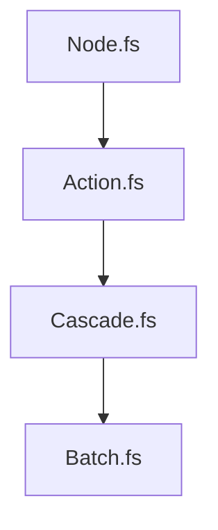

# GraphPipeline

The GraphPipeline coordinates the build process by sequencing several specialized components. Each component transforms the build graph, resolves dependencies, and determines execution strategy for efficient and correct builds.

## Node.fs

Builds the initial dependency graph from the workspace configuration.  
- Validates targets and projects.
- Recursively creates nodes for each project and target, resolving all dependencies.
- Discovers operations for each node using extension scripts.
- Computes hashes for caching and clustering.
- Initializes `Build` (defaults to `Always` when `--force` is set), and sets `Required = true` only for `BuildMode.Always`.
- Produces the raw graph structure with nodes and root nodes (roots are nodes with no dependents).

## Action.fs

Determines the `Action` for each node, using cache status and build options.  
- Walks the dependency graph starting from `RootNodes`, waiting on dependency signals before computing each node.
- Forces `Exec` when `BuildMode.Always` is set, or when any dependency is executing and not `BuildMode.Lazy` (upward cascade).
- For cacheable nodes:
  - `Retry` + failed summary -> `Exec`.
  - Failed summary -> `Summary` (report failure without rebuilding).
  - Successful summary -> `Restore`.
  - No summary -> `Exec`.
- For non-cacheable nodes -> `Exec`.
- Recomputes `RootNodes` after actions are assigned to include only `Exec` nodes that are not `BuildMode.Lazy`.

## Cascade.fs

Implements the cascading scheme for required nodes:
- Recomputes `Required` by walking dependents (reverse edges).
- A node is required if:
  - It was already required (`BuildMode.Always`), or
  - It is `Exec` and not `BuildMode.Lazy`, or
  - Any dependent is required.
- Nodes with `Action = Ignore` are not required.
- Nodes with `Action = Restore` and `Artifacts = External` are not required unless a dependent requires them.

## Batch.fs

Groups related executable and required nodes into clusters for batch execution.  
- Identifies batchable nodes based on configuration and script attributes.
- Creates cluster nodes, ensuring operations are discovered via extension scripts.
- Sets up batch contexts and cluster dependencies.

## Edge cases

- `Summary` or `Restore` nodes only run if they are required by a dependent (or were pre-marked required); otherwise they are skipped in the runner.
- A node with `BuildMode.Lazy` never becomes required unless a dependent requires it.
- `Restore` nodes with `Artifacts = External` are treated as not required unless a dependent requires them.
