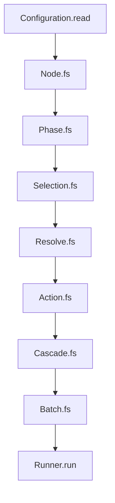

# GraphPipeline

The graph pipeline turns workspace configuration into the executable graph that the runner consumes. Each phase has a narrow responsibility, and every phase runs before any target command is invoked.

```mermaid
graph TD
    A[Configuration.read] --> B[Node.fs]
    B --> C[Phase.fs]
    C --> D[Selection.fs]
    D --> E[Resolve.fs]
    E --> F[Action.fs]
    F --> G[Cascade.fs]
    G --> H[Batch.fs]
    H --> I[Runner.run]
```

## Configuration.read

Reads `WORKSPACE` and `PROJECT` files, expands selected projects and target definitions, evaluates expressions, and loads extension metadata. This phase produces the configuration model consumed by the graph pipeline.

## Node.fs

Builds the full source graph from configuration.

- Validates that requested targets exist in `WORKSPACE`.
- Creates one node per configured project target, before command operations are resolved.
- Applies target dependency references:
  - `target.^name` adds upstream dependency projects that define `name`.
  - `target.name` adds the same-project target only when the project defines `name`.
- Combines workspace-level and project-level target dependencies.
- Detects circular target dependency chains and reports the chain as `Circular target dependency detected: ...`.
- Initializes `Build` from `--force` or target configuration.
- Sets `Required = true` only for `BuildMode.Always`.
- Produces `RootNodes` from the full graph: nodes that no other full-graph node depends on.

## Phase.fs

Lowers optional workspace phases into ordinary immutable graph dependencies.

- Phases are declared only in `WORKSPACE` and form an acyclic dependency graph.
- A target may reference one phase; project targets inherit a matching workspace target phase unless they use `phase = nothing`.
- Each phased node depends on every node assigned to every transitive prerequisite phase.
- Selecting a downstream node therefore enlists prerequisite-phase targets and their ordinary dependencies, including across an explicit project filter.
- Other targets in the selected node's own phase are not enlisted.
- Empty intermediate phases preserve transitive ordering.
- The combined ordinary and phase dependency graph is checked for cycles.
- Phase metadata does not participate in artifact target hashes.
- Target evaluation exposes the assigned name through `terrabuild.phase`, or `nothing` when unphased.

## Selection.fs

Narrows the full graph to the selected execution scope.

- Starts from `configuration.SelectedProjects` and the requested targets.
- Keeps each selected root and all dependencies reachable from it.
- Drops unrelated projects and targets before operation resolution.
- Recomputes root nodes for the selected graph.

This selected graph is the source graph used by run and impact. The web graph endpoint uses the same selected scope, then continues through resolve, action, cascade, and batch before rendering.

## Resolve.fs

Resolves operations and final cache inputs for each selected node.

- Invokes extension scripts to get command operations.
- Resolves command cacheability from extension metadata.
- Marks a node non-batchable when any command says it is not batchable.
- Computes the final target hash from project hash, target hash, resolved operations, and dependency target hashes.
- Applies explicit target cache overrides.
- Clears outputs when artifacts are not cacheable.
- Sets `ClusterHash` only when the resolved command set is batchable.

## Action.fs

Determines each node action without running commands.

- `Exec` when the node is forced by `--force` or `build = ~always`.
- `Exec` when a dependency is executing and the dependency is not `build = ~lazy`.
- `Exec` when the node is not cacheable.
- `Exec` when no cache summary exists.
- `Exec` for a failed cache summary when `--retry` is enabled.
- `Summary` for a failed cache summary without `--retry`, so the previous failure is reported without executing or restoring outputs.
- `Restore` for a successful cache summary.

After actions are assigned, root nodes are recalculated from the selected roots:

- `Exec` roots remain roots unless they are `build = ~lazy`.
- `Summary` roots remain roots so selected failed cache entries are reported.
- `Restore` roots are removed because successful cache hits do not need runner work unless required by a dependent.

## Cascade.fs

Marks the nodes that the runner must visit.

- A node remains required if it was already required by `BuildMode.Always`.
- A node becomes required when it is `Exec` and not `BuildMode.Lazy`.
- A node becomes required when any dependent is required.
- `Ignore` nodes are not required.
- `Restore` nodes with `Artifacts = External` are not required unless a dependent requires them.

## Batch.fs

Adds batch execution nodes after actions and required flags are known.

- Considers only required nodes with a `ClusterHash`.
- Partitions cluster candidates by phase; different phases and phased/unphased nodes never share a batch.
- Creates batches only in clusters that contain at least one `Exec` node.
- Requires more than one member in a batch candidate.
- Groups `batch = ~single` nodes into one candidate per cluster.
- Groups `batch = ~partition` nodes by connected components inside the cluster.
- Excludes `batch = ~never` nodes from batch candidates.
- Skips a candidate if adding the batch node would create an external dependency cycle.
- Creates a synthetic batch node with `BatchContext` and records the original member nodes for runner scheduling and logging.

## Debug outputs

When `--debug` is enabled, the run command writes the graph after the important construction stages:

- `terrabuild-debug.options.json`
- `terrabuild-debug.config.json`
- `terrabuild-debug.full-node.json`: full graph before selection
- `terrabuild-debug.node.json`: selected source graph
- `terrabuild-debug.resolve.json`: resolved operations, hashes, cache mode, and cluster hash
- `terrabuild-debug.action.json`: assigned actions
- `terrabuild-debug.cascade.json`: required flags after cascade
- `terrabuild-debug.batch.json`: final graph before the runner
- `terrabuild-debug.info.md`

## Edge cases

- Lazy roots do not run just because they are selected; they run only when required by a dependent.
- Failed cached selected roots remain runner roots as `Summary`, so failures are reported correctly.
- Successful restore roots are skipped unless a dependent requires them.
- External restore nodes are skipped unless a dependent requires them.
- Missing target references are permissive inside dependency expansion: `target.name` and `target.^name` add only targets that exist in the relevant project scope.
- Circular target dependency chains are invalid and reported during graph construction.
- Failures in a prerequisite phase leave downstream phase dependencies unsatisfied, so downstream operations do not run.
