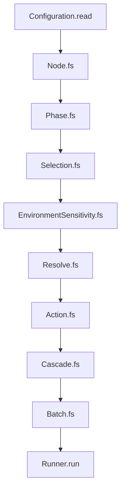

# GraphPipeline

The graph pipeline turns workspace configuration into the executable graph that the runner consumes. Each phase has a narrow responsibility, and every phase runs before any target command is invoked.

```mermaid
graph TD
    A[Configuration.read] --> B[Node.fs]
    B --> C[Phase.fs]
    C --> D[Selection.fs]
    D --> E[EnvironmentSensitivity.fs]
    E --> F[Resolve.fs]
    F --> G[Action.fs]
    G --> H[Cascade.fs]
    H --> I[Batch.fs]
    I --> J[Runner.run]
```

## Configuration.read

Reads `WORKSPACE` and `PROJECT` files, expands selected projects and target definitions, evaluates expressions, and loads extension metadata. This phase produces the configuration model consumed by the graph pipeline.

## Node.fs

Builds the full source graph from configuration.

- Validates that requested targets exist in `WORKSPACE`.
- Creates one node per configured project target, before command operations are resolved.
- Applies target dependency references:
  - `target.^name` adds upstream dependency projects that define `name`.
  - `target.name` adds the same-project target only when the project defines `name`.
- Combines workspace-level and project-level target dependencies.
- Detects circular target dependency chains and reports the chain as `Circular target dependency detected: ...`.
- Initializes `Build` from `--force` or target configuration.
- Carries an optional inherited target `lock` into the node's execution-lock set. Lock metadata does not participate in artifact target hashes.
- Sets `Required = true` only for `BuildMode.Always`.
- Produces `RootNodes` from the full graph: nodes that no other full-graph node depends on.

## Phase.fs

Lowers optional workspace phases into ordinary immutable graph dependencies.

- Phases are declared only in `WORKSPACE` and form an acyclic dependency graph.
- A target may reference one phase; project targets inherit a matching workspace target phase unless they use `phase = nothing`.
- Each phased node depends on every node assigned to every transitive prerequisite phase.
- Selecting a downstream node therefore enlists prerequisite-phase targets and their ordinary dependencies, including across an explicit project filter.
- Other targets in the selected node's own phase are not enlisted.
- Empty intermediate phases preserve transitive ordering.
- The combined ordinary and phase dependency graph is checked for cycles.
- Phase metadata does not participate in artifact target hashes.
- Target evaluation exposes the assigned name through `terrabuild.phase`, or `nothing` when unphased.

## Selection.fs

Narrows the full graph to the selected execution scope.

- Starts from `configuration.SelectedProjects` and the requested targets.
- Keeps each selected root and all dependencies reachable from it.
- Drops unrelated projects and targets before operation resolution.
- Recomputes root nodes for the selected graph.

This selected graph is the source graph used by run and impact. The web graph endpoint uses the same selected scope, then continues through resolve, action, cascade, and batch before rendering.

## EnvironmentSensitivity.fs

Validates environment neutrality before extension operations are resolved.

- Targets are neutral by default.
- A neutral target that directly or transitively consumes an environment-sensitive built-in fails with every violating node and input name listed.
- `environment_sensitive = true` is an explicit opt-in. For opted-in targets, the sensitive input value hashes become cache-key inputs.
- The opt-in does not add a separate policy hash dimension; opted-in sensitive value hashes provide the environment-specific dimension.
- `explain` and the local console retain the selected graph for diagnosis without executing targets; normal runs, dry runs, serves, logs, and impact checks enforce the policy.

## Resolve.fs

Resolves operations and final cache inputs for each selected node.

- Invokes extension scripts to get command operations.
- Resolves each command's cacheability from extension metadata. When a target has
  multiple commands, the last command deliberately defines the target's default
  artifact mode. Command order therefore controls artifact ownership; an explicit
  target `artifacts` value overrides that default.
- Marks a node non-batchable when any command says it is not batchable.
- Computes the final target hash from project hash, target hash, resolved operations, and dependency target hashes.
- Adds a one-way aggregate fingerprint of declared forwarded environment names and values to resolved operation cache inputs without retaining their plaintext values.
- Applies explicit target cache overrides.
- Clears outputs when artifacts are not cacheable.
- Sets `ClusterHash` only when the resolved command set is batchable.

## Action.fs

Determines each node action without running commands.

- `Exec` when the node is forced by `--force` or `build = ~always`.
- `Exec` when an ordinary target dependency is executing and the dependency is not `build = ~lazy`; phase-only dependencies do not propagate execution.
- `Exec` when the node is not cacheable.
- `Exec` when no cache summary exists.
- `Exec` for a failed cache summary when `--retry` is enabled.
- `Summary` for a failed cache summary without `--retry`, so the previous failure is reported without executing or restoring outputs.
- `Restore` for a successful cache summary.

After actions are assigned, root nodes are recalculated from the selected roots:

- `Exec` roots remain roots and are marked required, including roots using `build = ~lazy`.
- `Summary` roots remain roots so selected failed cache entries are reported.
- `Restore` roots are removed because successful cache hits do not need runner work unless required by a dependent.

## Cascade.fs

Marks the nodes that the runner must visit.

- A node remains required if it was already required by `BuildMode.Always`.
- An explicitly selected `Exec` root remains required even when it uses `BuildMode.Lazy`.
- A node becomes required when it is `Exec` and not `BuildMode.Lazy`.
- A node becomes required when a dependent is both required and executing.
- `Restore` and `Summary` nodes are realization barriers: their cached result does not require their own build-time dependencies.
- `Ignore` nodes are not required.
- `Restore` nodes with `Artifacts = External` are never scheduled: the successful summary is sufficient because the artifact is managed outside Terrabuild.

## Batch.fs

Adds batch execution nodes after actions and required flags are known.

- Considers only required nodes with a `ClusterHash`.
- Partitions cluster candidates by phase; different phases and phased/unphased nodes never share a batch.
- Creates batches only in clusters that contain at least one `Exec` node.
- Requires more than one member in a batch candidate.
- Groups `batch = ~single` nodes into one candidate per cluster.
- Groups `batch = ~partition` nodes by connected components inside the cluster.
- Excludes `batch = ~never` nodes from batch candidates.
- Skips a candidate if adding the batch node would create an external dependency cycle.
- Creates a synthetic batch node with `BatchContext` and records the original member nodes for runner scheduling and logging.
- Assigns the synthetic batch node the union of its members' named locks.

## TargetLock.fs and Runner.run

Executing nodes acquire their named locks in deterministic order before commands start. Managed and workspace cache hits acquire the same locks before replacing declared outputs; summary-only external cache hits do not. Lock files live under the user-global Terrabuild profile rather than the workspace or mounted build home. Ownership is represented by an open handle with exclusive sharing, so locks coordinate separate Terrabuild processes and are released automatically after exceptions, process termination, or reboot. Batch leases cover member log and output staging; cache entry publication remains protected independently by per-entry cache locks. Progress and diagnostics distinguish lock waiting from command execution or restore time, and diagnostic graph nodes expose their lock names.

Every command holds a process lease in the global profile. Cache clearing acquires the profile gate and fails safely when any process lease is still active; stale leases from terminated processes are reclaimed. This prevents clearing directories or lock inodes out from under an executing graph.

Container executions keep an exclusively leased record in the global profile. Cancellation removes the daemon-owned Docker or Podman container before terminating its local CLI process. If Terrabuild is killed abruptly, the next invocation reaps unlocked records before configuration recovery or hashing, preventing an orphan from continuing to mutate mounted workspace or cache files.

Local cache publication keeps the previous completed entry as a sibling backup until the replacement directory is visible. The next locked lookup restores that backup if publication was interrupted, or removes it if the replacement was already committed.

Remote cache publication writes logs and outputs to an immutable generation, verifies their digests when downloading, and publishes the generation manifest last. Readers therefore observe either the previous complete generation or the new complete generation, never a mixture. Missing, corrupt, unreadable, or temporarily unavailable remote blobs are cache misses and cause execution instead of aborting the build. A remote publication failure retains the completed local entry and leaves no local manifest advertising the incomplete generation. Legacy fixed-path blobs remain readable when no manifest exists.

Workspace output restores register a pointer under the global profile before their first workspace mutation. Startup recovery enumerates this transaction index rather than recursively scanning every directory in the monorepo. Each workspace performs one legacy scan after upgrading so an interrupted restore created by an older Terrabuild remains recoverable; the durable migration marker survives cache clearing.

Cache entries have an explicit disposable staging lifecycle. Synthetic batch entries are scratch log owners and are discarded after their logs have been copied to member entries; completed member entries publish atomically, while preparation failures dispose every affected entry. Each staging directory owns an exclusive lease file. Normal disposal removes it, and cache pruning reclaims an old staging directory only when that lease is no longer held, so process-death leftovers do not accumulate and a live producer is not disturbed. Workspace output restoration uses a journaled sibling transaction and a per-project profile lock. The journal switches to `applying` before declared files are replaced and to `committed` afterward. Configuration loading first discovers transactions for the workspace and rolls interrupted `applying` transactions back before files are read or hashed; committed transactions only need cleanup. Exclusive file handles serialize this recovery across Terrabuild processes and are released by the operating system after process death.

## Debug outputs

When `--debug` is enabled, the run command writes `terrabuild-debug.json`, a versioned report checkpointed after configuration and each graph stage and finalized after execution. Schema version 6 adds the `summary` request and `blocked` result states, allowing consumers to distinguish cached failures from file restores and dependency-blocked tasks from attempted failures. Nodes appear once and include selection, resolved fingerprints, structured action and requirement reasons, batch membership, logical results, and monotonic timing. They also include the evaluated input names that affected the target, identify environment-sensitive built-ins separately, and provide a secret-safe view of resolved operations. Argument and injected environment values are hashed. Forwarded environment variables are represented by name plus one aggregate fingerprint; their plaintext values are supplied to the container engine through its process environment and never rendered into command arguments or retained. `terrabuild-debug.log` retains chronological commands and exceptional details. Both files replace their previous-run versions.

The report's action reasons are `forced-cli`, `configured-always`, `dependency-executed`, `non-cacheable`, `cache-miss`, `cache-outputs-missing`, `retry-failed-cache`, `cached-failure`, and `cache-hit`. `cache-outputs-missing` means that a successful managed or workspace summary exists but its declared output archive is unavailable, so execution is safer than reporting a restore that cannot be completed. Cache evidence includes the lookup scope, key, result, origin, prior status, and summary time. Project and target fingerprint components allow two reports to be compared without changing the cache-key algorithm.

Synthetic batch scheduler nodes are represented under `batches` and `executions`, not as logical results. Performance data records batches once, ranks slow phases and tasks, and derives a dependency-aware critical chain.

Planned actions remain available for explaining scheduler decisions, while final outcomes come from runner results. Runner requests distinguish `Exec`, `Restore`, and cached-failure `Summary`; a summary is never mislabeled as a file restoration. Task status also distinguishes attempted failures from dependency-blocked tasks, and records the direct blockers instead of leaking an internal scheduler placeholder into reports. A cache restore that loses its outputs and falls back to execution is reported as `execute` with reason `restore-missed`. Execution results are recorded before cache and Insights publication, so a publication failure still produces a partial diagnostic containing completed work. The canonical diagnostic is finalized before optional run-result and rendered-log reports; a renderer failure updates the run error without discarding the execution summary. Logical and physical batch reporting are intentionally separate: a cached member included in a native batch remains `restore (batch-cache-reuse)` because its existing artifact is reused rather than replaced, while `batchId` joins it to the synthetic physical execution. Batch execution timing continues through synchronous member output staging and all member cache/API publications; the batch is not reported complete before finalization finishes.

## Edge cases

- Action evaluation fails closed if any scheduler subscription remains unfulfilled; a partially evaluated action graph is never passed to cascading or execution.
- Explicitly selected lazy roots execute when their action is `Exec`; laziness controls dependency realization and rebuild propagation, not explicit selection.
- Lazy dependencies behind a restored or summarized node are not realized unless another executing node requires them directly.
- Failed cached selected roots remain runner roots as `Summary`, so failures are reported correctly.
- Successful restore roots are skipped unless a dependent requires them.
- External cache hits reuse only the execution summary; Terrabuild never restores externally managed artifacts, even when an executing target depends on them.
- Missing target references are permissive inside dependency expansion: `target.name` and `target.^name` add only targets that exist in the relevant project scope.
- Cached outputs use explicit not-managed, empty, and stored states; restoring an empty managed snapshot removes stale declared files.
- Circular target dependency chains are invalid and reported during graph construction.
- Environment-sensitive predefined inputs are invalid unless the consuming target explicitly sets `environment_sensitive = true`.
- Failures in a prerequisite phase leave downstream phase dependencies unsatisfied, so downstream operations do not run.
