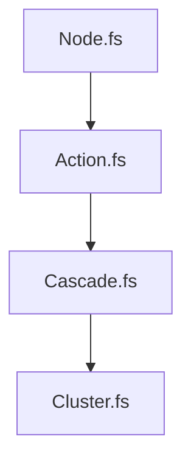

# GraphPipeline

The GraphPipeline coordinates the build process by sequencing several specialized components. Each component transforms the build graph, resolves dependencies, and determines execution strategy for efficient and correct builds.

## Nodes.fs

Builds the initial dependency graph from the workspace configuration.  
- Validates targets and projects.
- Recursively creates nodes for each project and target, resolving all dependencies.
- Discovers operations for each node using extension scripts.
- Computes hashes for caching and clustering.
- Produces the raw graph structure with nodes and root nodes.

# Action.fs

Determines the build actions for each node and cluster, using build status if available.  
- Evaluates which nodes need to be built, restored, or ignored.
- Applies rules based on cache status, previous build results, and configuration.
- Prepares the build request for execution.
- Enforce "if children builds then parent builds" rule.

# Cascade.fs

Implements the cascading scheme for required nodes:
- Applies cascade attributes to propagate required attribute through dependencies.
- Ensures that a required node has children nodes marked as required.

# Batch.fs

Groups related executable and required nodes into clusters for batch execution.  
- Identifies batchable nodes based on configuration and script attributes.
- Creates cluster nodes, ensuring operations are discovered via extension scripts.
- Sets up batch contexts and cluster dependencies.

