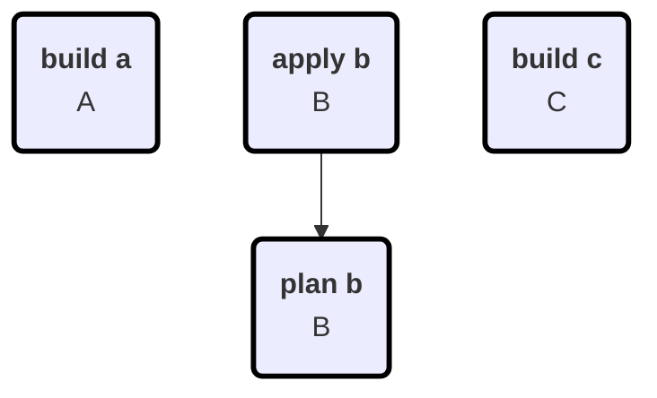

# Configuration

| Option | Value |
|--------|-------|
| Targets | apply build plan test |
| Force | True |
| LocalOnly | True |
| MaxConcurrency | 1 |
| ContainerTool | docker |
| Debug | True |

# Build Graph

