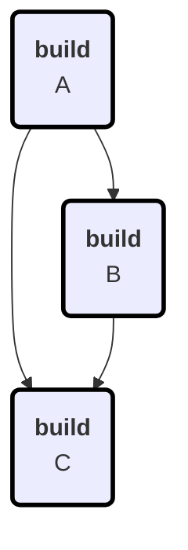

# Terrabuild
* Version: v0.0.0+aa770bd59a7a7a7c690798192d2fa0d6181a81c4
* Location: /Users/pct/src/MagnusOpera/Terrabuild/src/Terrabuild/bin/Debug/net9.0/terrabuild.dll

# Options
* StartedAt: 8/18/2025 12:05:11 PM
 * Targets: build
* Workspace: /Users/pct/src/MagnusOpera/Terrabuild/tests/multirefs
* Force: True
* Retry: False
* MaxConcurrency: 2
* LocalOnly: True
* BranchOrTag: feature/mermaid-markdown
* HeadCommit: aa770bd59a7a7a7c690798192d2fa0d6181a81c4
* ContainerTool: docker
* WhatIf: False
* Debug: True

# Build Graph

