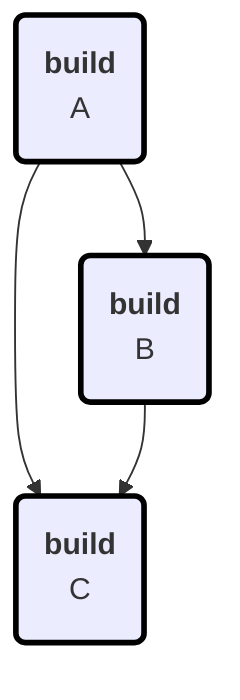

# Options
 * Targets: build
* Force: True
* Retry: False
* MaxConcurrency: 2
* LocalOnly: True
* ContainerTool: docker
* WhatIf: False
* Debug: True

# Build Graph

```mermaid
flowchart TD
classDef build stroke:red,stroke-width:3px
classDef restore stroke:orange,stroke-width:3px
classDef ignore stroke:black,stroke-width:3px
a:build("<b>build</b> 
A")
b:build("<b>build</b> 
B")
c:build("<b>build</b> 
C")
a:build --> b:build
a:build --> c:build
class a:build ignore
b:build --> c:build
class b:build ignore
class c:build ignore
```
