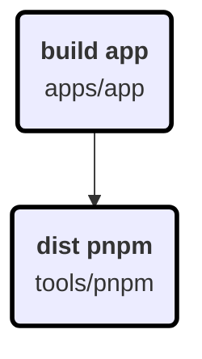

# Configuration

| Option | Value |
|--------|-------|
| Targets | build |
| Projects | app |
| Force | True |
| LocalOnly | True |
| MaxConcurrency | 2 |
| Engine | docker |
| Debug | True |

# Build Graph

