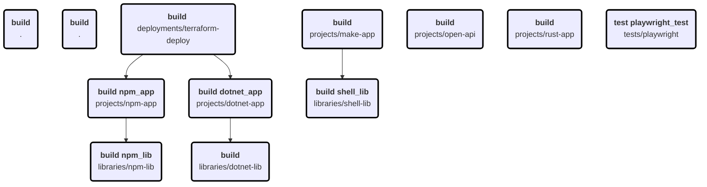

# Configuration

| Option | Value |
|--------|-------|
| Targets | build test |
| Force | True |
| LocalOnly | True |
| MaxConcurrency | 2 |
| Engine | docker |
| Debug | True |

# Build Graph

```mermaid
flowchart TD
classDef build stroke:red,stroke-width:3px
classDef restore stroke:orange,stroke-width:3px
classDef ignore stroke:black,stroke-width:3px
76E6F8566C567ED61454D9A9EC6ED7D096DBD92DDB5CAD796F9B7EB5EB3595C6("<b>build</b> 
.")
#pnpm#npm-app:build("<b>build npm_app</b> 
projects/npm-app")
#pnpm#npm-lib:build("<b>build npm_lib</b> 
libraries/npm-lib")
E26E627E00DC63984574A9CFAD93DBAC058522CE652BB3DC444648A748AB900A("<b>build</b> 
.")
workspace/path#deployments/terraform-deploy:build("<b>build</b> 
deployments/terraform-deploy")
workspace/path#libraries/dotnet-lib:build("<b>build</b> 
libraries/dotnet-lib")
workspace/path#libraries/shell-lib:build("<b>build shell_lib</b> 
libraries/shell-lib")
workspace/path#projects/dotnet-app:build("<b>build dotnet_app</b> 
projects/dotnet-app")
workspace/path#projects/make-app:build("<b>build</b> 
projects/make-app")
workspace/path#projects/open-api:build("<b>build</b> 
projects/open-api")
workspace/path#projects/rust-app:build("<b>build</b> 
projects/rust-app")
workspace/path#tests/playwright:test("<b>test playwright_test</b> 
tests/playwright")
class 76E6F8566C567ED61454D9A9EC6ED7D096DBD92DDB5CAD796F9B7EB5EB3595C6 ignore
#pnpm#npm-app:build --> #pnpm#npm-lib:build
class #pnpm#npm-app:build ignore
class #pnpm#npm-lib:build ignore
class E26E627E00DC63984574A9CFAD93DBAC058522CE652BB3DC444648A748AB900A ignore
workspace/path#deployments/terraform-deploy:build --> #pnpm#npm-app:build
workspace/path#deployments/terraform-deploy:build --> workspace/path#projects/dotnet-app:build
class workspace/path#deployments/terraform-deploy:build ignore
class workspace/path#libraries/dotnet-lib:build ignore
class workspace/path#libraries/shell-lib:build ignore
workspace/path#projects/dotnet-app:build --> workspace/path#libraries/dotnet-lib:build
class workspace/path#projects/dotnet-app:build ignore
workspace/path#projects/make-app:build --> workspace/path#libraries/shell-lib:build
class workspace/path#projects/make-app:build ignore
class workspace/path#projects/open-api:build ignore
class workspace/path#projects/rust-app:build ignore
class workspace/path#tests/playwright:test ignore
```

