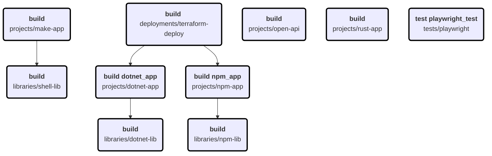

# Terrabuild
* Version: v0.0.0+931083a8c2acb31fb5b454c5fc2f20eb4b29d11f
* Location: /Users/pct/src/MagnusOpera/Terrabuild/src/Terrabuild/bin/Debug/net9.0/terrabuild.dll

# Options
* StartedAt: 8/18/2025 10:25:06 AM
 * Targets: build test
* Workspace: /Users/pct/src/MagnusOpera/Terrabuild/tests/simple
* Force: True
* Retry: False
* MaxConcurrency: 2
* LocalOnly: True
* BranchOrTag: feature/mermaid-markdown
* HeadCommit: 931083a8c2acb31fb5b454c5fc2f20eb4b29d11f
* ContainerTool: docker
* WhatIf: False
* Debug: True

# Build Graph

