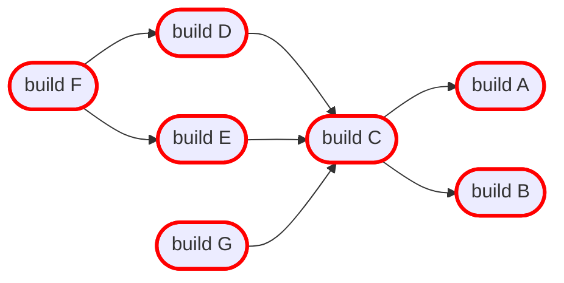
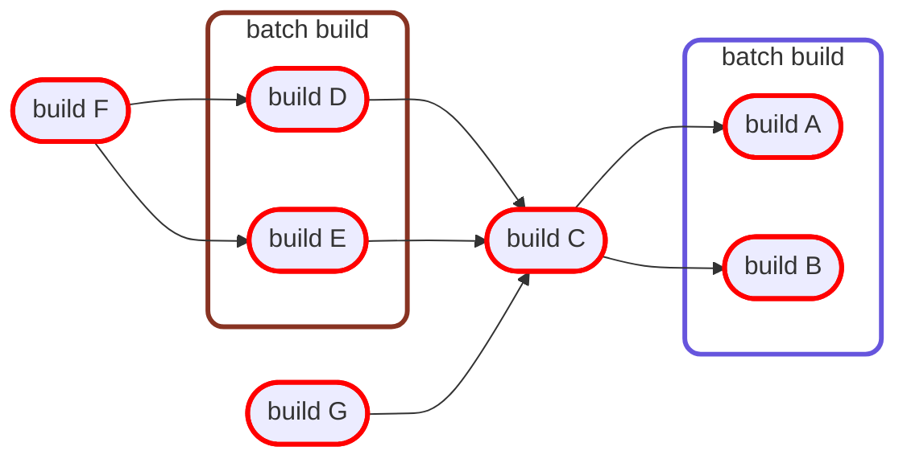

Time for beta release! **Terrabuild** has gone several changes, and for good 🎉

Past months have been used to dogfood Terrabuild with Magnus Opera's infrastructure (.net backend, React front-end, Kubernetes and other things deployed via Terraform). Dogfooding has helped a lot to squash several embarassing bugs, implement several really useful features and improve performance.

## Stability
Terrabuild reached a really good level of stability:
* Parser has been enhanced to report better errors and grammar has reached the required level of maturity
* Performance of containers has improved a lot: home folder is now shared for same container architecture
* Fix bug on reproducibility of the build (hash computation was incomplete)
* Idempotency for local/remote build has been solved as well (hash was computed on different set of commands)

## New optimizer
The new optimizer has much more power than previous one: it can now track multiple clusters of the same type on different causalities. Old optimizer was only able to optimize one cluster type for the whole build (for example, a single .net build was supported).

**Here is a sample workspace**

**Terrabuild is now able to optimize this way**

**Real life optimizations applied on Terrabuild itself**

```mermaid
flowchart LR
classDef forced stroke:red,stroke-width:3px
classDef required stroke:orange,stroke-width:3px
classDef selected stroke:black,stroke-width:3px
subgraph 5E3C39817550AEDCC02326DA195DE0B1C25EFC83FAF8842732E01CD3D31682BA[batch build]
  193BB912F9478BB40DC4DAC7CB9EC33DE04F7DE26CAD23565A900D07BBE8DA74([build Terrabuild.Common.Tests])
  909DA059580F0EDCA6DAE2334C64D08C75F6A96057FA06104A1327B2CCFA3F83([build Terrabuild.Common])
  9F37838D2ADF858B4CD2A52C377183901582CA3314B43728EACB6689FA690188([build Terrabuild.Configuration.Tests])
  47DB938158C5366C2CDC7BBCE8355DB20D53DF36515534E6ACB7B4A57031B4A0([build Terrabuild.Configuration])
  0AED0132AC24F24C994C67DD3698DADD5E46F865ABA82430402A88D5F449F678([build Terrabuild.Expressions.Tests])
  613DAFF6BC5AB6C79E840CF3AA76A2485A3295CB8B2BD8B6E6E67A464FFC3EBB([build Terrabuild.Expressions])
  A58F713A400B91776C9D762B12E2653B8DB47976340A792D6010F77CEF50E1CC([build Terrabuild.Extensibility])
  91217077982CBB79F69B7F6CE7374672B2062CFE37583FF17CAE1F0EE7A7DBED([build Terrabuild.Extensions])
  ABEDF9B0E1CA557EF935860B83FC1031B2FDEA30FB2027C2F760A43489B092FB([build Terrabuild.PubSub.Tests])
  BF4ED535EE4F857F3DEA45A493B6690E74EE8DF9A31208E0A46333833BF1D62E([build Terrabuild.PubSub])
  882A0E463A098C4A6FB89C39D5E1F7247B3E85A81505617FC08CE5605EDC6E4F([build Terrabuild.Scripting.Tests])
  22266CC1A217703C5F9C97F3AFA3333A50CBF41A8DDAA1A985A6A43CAF8BCF83([build Terrabuild.Scripting])
  985B9164950C731321520F9802800D86EE0301153C8DAC268A66168B258745C8([build Terrabuild.Tests])
  9AF519F11A4D9770940E7FEDD536C49944268C40E824F7D2F9327F087CA62CC4([build Terrabuild])
end
classDef cluster-5E3C39817550AEDCC02326DA195DE0B1C25EFC83FAF8842732E01CD3D31682BA stroke:#FBC,stroke-width:3px,fill:white,rx:10,ry:10
class 5E3C39817550AEDCC02326DA195DE0B1C25EFC83FAF8842732E01CD3D31682BA cluster-5E3C39817550AEDCC02326DA195DE0B1C25EFC83FAF8842732E01CD3D31682BA
193BB912F9478BB40DC4DAC7CB9EC33DE04F7DE26CAD23565A900D07BBE8DA74 --> 909DA059580F0EDCA6DAE2334C64D08C75F6A96057FA06104A1327B2CCFA3F83
class 193BB912F9478BB40DC4DAC7CB9EC33DE04F7DE26CAD23565A900D07BBE8DA74 required
class 909DA059580F0EDCA6DAE2334C64D08C75F6A96057FA06104A1327B2CCFA3F83 required
9F37838D2ADF858B4CD2A52C377183901582CA3314B43728EACB6689FA690188 --> 47DB938158C5366C2CDC7BBCE8355DB20D53DF36515534E6ACB7B4A57031B4A0
class 9F37838D2ADF858B4CD2A52C377183901582CA3314B43728EACB6689FA690188 required
47DB938158C5366C2CDC7BBCE8355DB20D53DF36515534E6ACB7B4A57031B4A0 --> 613DAFF6BC5AB6C79E840CF3AA76A2485A3295CB8B2BD8B6E6E67A464FFC3EBB
class 47DB938158C5366C2CDC7BBCE8355DB20D53DF36515534E6ACB7B4A57031B4A0 required
0AED0132AC24F24C994C67DD3698DADD5E46F865ABA82430402A88D5F449F678 --> 613DAFF6BC5AB6C79E840CF3AA76A2485A3295CB8B2BD8B6E6E67A464FFC3EBB
class 0AED0132AC24F24C994C67DD3698DADD5E46F865ABA82430402A88D5F449F678 required
613DAFF6BC5AB6C79E840CF3AA76A2485A3295CB8B2BD8B6E6E67A464FFC3EBB --> 909DA059580F0EDCA6DAE2334C64D08C75F6A96057FA06104A1327B2CCFA3F83
class 613DAFF6BC5AB6C79E840CF3AA76A2485A3295CB8B2BD8B6E6E67A464FFC3EBB required
class A58F713A400B91776C9D762B12E2653B8DB47976340A792D6010F77CEF50E1CC required
91217077982CBB79F69B7F6CE7374672B2062CFE37583FF17CAE1F0EE7A7DBED --> 909DA059580F0EDCA6DAE2334C64D08C75F6A96057FA06104A1327B2CCFA3F83
91217077982CBB79F69B7F6CE7374672B2062CFE37583FF17CAE1F0EE7A7DBED --> A58F713A400B91776C9D762B12E2653B8DB47976340A792D6010F77CEF50E1CC
class 91217077982CBB79F69B7F6CE7374672B2062CFE37583FF17CAE1F0EE7A7DBED required
ABEDF9B0E1CA557EF935860B83FC1031B2FDEA30FB2027C2F760A43489B092FB --> BF4ED535EE4F857F3DEA45A493B6690E74EE8DF9A31208E0A46333833BF1D62E
class ABEDF9B0E1CA557EF935860B83FC1031B2FDEA30FB2027C2F760A43489B092FB required
class BF4ED535EE4F857F3DEA45A493B6690E74EE8DF9A31208E0A46333833BF1D62E required
882A0E463A098C4A6FB89C39D5E1F7247B3E85A81505617FC08CE5605EDC6E4F --> A58F713A400B91776C9D762B12E2653B8DB47976340A792D6010F77CEF50E1CC
882A0E463A098C4A6FB89C39D5E1F7247B3E85A81505617FC08CE5605EDC6E4F --> 22266CC1A217703C5F9C97F3AFA3333A50CBF41A8DDAA1A985A6A43CAF8BCF83
class 882A0E463A098C4A6FB89C39D5E1F7247B3E85A81505617FC08CE5605EDC6E4F required
22266CC1A217703C5F9C97F3AFA3333A50CBF41A8DDAA1A985A6A43CAF8BCF83 --> 613DAFF6BC5AB6C79E840CF3AA76A2485A3295CB8B2BD8B6E6E67A464FFC3EBB
class 22266CC1A217703C5F9C97F3AFA3333A50CBF41A8DDAA1A985A6A43CAF8BCF83 required
985B9164950C731321520F9802800D86EE0301153C8DAC268A66168B258745C8 --> 9AF519F11A4D9770940E7FEDD536C49944268C40E824F7D2F9327F087CA62CC4
class 985B9164950C731321520F9802800D86EE0301153C8DAC268A66168B258745C8 required
9AF519F11A4D9770940E7FEDD536C49944268C40E824F7D2F9327F087CA62CC4 --> 909DA059580F0EDCA6DAE2334C64D08C75F6A96057FA06104A1327B2CCFA3F83
9AF519F11A4D9770940E7FEDD536C49944268C40E824F7D2F9327F087CA62CC4 --> 47DB938158C5366C2CDC7BBCE8355DB20D53DF36515534E6ACB7B4A57031B4A0
9AF519F11A4D9770940E7FEDD536C49944268C40E824F7D2F9327F087CA62CC4 --> A58F713A400B91776C9D762B12E2653B8DB47976340A792D6010F77CEF50E1CC
9AF519F11A4D9770940E7FEDD536C49944268C40E824F7D2F9327F087CA62CC4 --> 91217077982CBB79F69B7F6CE7374672B2062CFE37583FF17CAE1F0EE7A7DBED
9AF519F11A4D9770940E7FEDD536C49944268C40E824F7D2F9327F087CA62CC4 --> BF4ED535EE4F857F3DEA45A493B6690E74EE8DF9A31208E0A46333833BF1D62E
9AF519F11A4D9770940E7FEDD536C49944268C40E824F7D2F9327F087CA62CC4 --> 22266CC1A217703C5F9C97F3AFA3333A50CBF41A8DDAA1A985A6A43CAF8BCF83
class 9AF519F11A4D9770940E7FEDD536C49944268C40E824F7D2F9327F087CA62CC4 required
subgraph 8D8E199EEF5C7E12EC77AB68EB1D3A7F7804093506039F6B273482C256A326CF[batch test]
  A12312C97DD1A89D723FE05D55B838FD30A88D2B0770465841B5C9ECE3677B5C([test Terrabuild.Common.Tests])
  94ED206E2AC00C196F1FCE74673F7A177779C13FEC910851E93E1E39E02E1066([test Terrabuild.Configuration.Tests])
  DBB93749459C56830222D7DA400AAD078CB9D1A4C4A752633E2C05887B3EB4F8([test Terrabuild.Expressions.Tests])
  4B84CD42552C56D3351E78188089601E383B57E04155DFBE0C9E51E872593AF2([test Terrabuild.PubSub.Tests])
  1EB0018B20D23FB8CA4D9824C68C690F1789ABA05F5F2384158026E5CBE809F4([test Terrabuild.Scripting.Tests])
  8431C1F7AEB702219D8832EFEC531C5E40FB29FF489B8CF9B4ABFDDED16883C0([test Terrabuild.Tests])
end
classDef cluster-8D8E199EEF5C7E12EC77AB68EB1D3A7F7804093506039F6B273482C256A326CF stroke:#BEA,stroke-width:3px,fill:white,rx:10,ry:10
class 8D8E199EEF5C7E12EC77AB68EB1D3A7F7804093506039F6B273482C256A326CF cluster-8D8E199EEF5C7E12EC77AB68EB1D3A7F7804093506039F6B273482C256A326CF
A12312C97DD1A89D723FE05D55B838FD30A88D2B0770465841B5C9ECE3677B5C --> 193BB912F9478BB40DC4DAC7CB9EC33DE04F7DE26CAD23565A900D07BBE8DA74
class A12312C97DD1A89D723FE05D55B838FD30A88D2B0770465841B5C9ECE3677B5C required
94ED206E2AC00C196F1FCE74673F7A177779C13FEC910851E93E1E39E02E1066 --> 9F37838D2ADF858B4CD2A52C377183901582CA3314B43728EACB6689FA690188
class 94ED206E2AC00C196F1FCE74673F7A177779C13FEC910851E93E1E39E02E1066 required
DBB93749459C56830222D7DA400AAD078CB9D1A4C4A752633E2C05887B3EB4F8 --> 0AED0132AC24F24C994C67DD3698DADD5E46F865ABA82430402A88D5F449F678
class DBB93749459C56830222D7DA400AAD078CB9D1A4C4A752633E2C05887B3EB4F8 required
4B84CD42552C56D3351E78188089601E383B57E04155DFBE0C9E51E872593AF2 --> ABEDF9B0E1CA557EF935860B83FC1031B2FDEA30FB2027C2F760A43489B092FB
class 4B84CD42552C56D3351E78188089601E383B57E04155DFBE0C9E51E872593AF2 required
1EB0018B20D23FB8CA4D9824C68C690F1789ABA05F5F2384158026E5CBE809F4 --> 882A0E463A098C4A6FB89C39D5E1F7247B3E85A81505617FC08CE5605EDC6E4F
class 1EB0018B20D23FB8CA4D9824C68C690F1789ABA05F5F2384158026E5CBE809F4 required
8431C1F7AEB702219D8832EFEC531C5E40FB29FF489B8CF9B4ABFDDED16883C0 --> 985B9164950C731321520F9802800D86EE0301153C8DAC268A66168B258745C8
class 8431C1F7AEB702219D8832EFEC531C5E40FB29FF489B8CF9B4ABFDDED16883C0 required
C6D0432181CDBE8A9D80D575A2B5B79462BEE144BE699D3649198F8D34E49CA1([dist Terrabuild])
C6D0432181CDBE8A9D80D575A2B5B79462BEE144BE699D3649198F8D34E49CA1 --> 9AF519F11A4D9770940E7FEDD536C49944268C40E824F7D2F9327F087CA62CC4
class C6D0432181CDBE8A9D80D575A2B5B79462BEE144BE699D3649198F8D34E49CA1 required
```

## Reports
Build summary has been introduced on GitHub Actions:
* Tasks summary
* Build graph
* Logs

The build summary provides an overview of build performance and status: it's even better than current GitHub build log 😎

## Partial graph invalidation
If a node has children and those are rebuilt appart, it's obvious the node shall be rebuilt (because it is younger than children). That was the case in the same build - but not across builds.

This is now supported since it's a valid scenario (for example with `terraform plan/apply` on several jobs).

## Extensions
* Rust (Cargo projects) has been added
* Dotnet is able to optimize `test` command now

## Overall performance
Accessing the global cache to check if a node is used are not was costly before: the whole summary and outputs were downloaded for all nodes 😬 This was inefficient since most of the time only a few nodes changes and only node status is required.

Terrabuild implements now a better check strategy: it only download summary if the status of a node is uncertain. If the node is not required, outputs won't even be downloaded. In some cases, it won't even bother to check the task if not required at all. This really improves I/O and overall build performance 🎉

 
 

# Want to give it a try ?

Terrabuild really shines with a shared cache. If you want to give it a try, reach us at `beta@magnusopera.io` and we'll get you a test account as well instructions to use Terrabuild in CI context. Shared caching is free while Terrabuild is in testing phase.

## Questions or Feedback?
Would like to send us feedbacks on this new product?\
Something looks wrong or not clear?\
Want to say you love Terrabuild?\
Well, feel free to contact us at `beta@magnusopera.io`!
