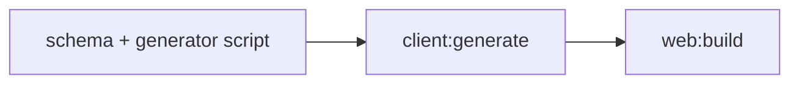
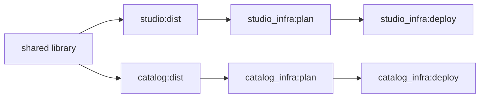

Once you have [run a small workflow](./quick-start.md) and
[configured environments](./environments.md), the same model extends to larger
repositories. Each scenario below introduces one additional coordination rule.
The snippets are patterns to adapt to your existing tools and files.

## Generated code before consumers

**Situation:** a frontend consumes a client generated from an API schema. The
package manager cannot discover this relationship from its native dependencies.

Create a project for the schema and generator:

```terrabuild title="contracts/PROJECT"
project client {
  outputs = [ "generated/**" ]
}

target generate {
  artifacts = ~workspace
  @shell sh { args = "generate.sh" }
}
```

This assumes `contracts/generate.sh` reads schema files in the project and writes
the client under `contracts/generated/`. The script and schema are source inputs;
the generated directory should be excluded from source tracking.

Connect the consumer:

```terrabuild title="apps/web/PROJECT"
project web {
  depends_on = [ project.client ]
  outputs = [ "dist/**" ]
}

target build {
  depends_on = [ target.^generate ]
  artifacts = ~workspace
  @shell sh { args = "build.sh" }
}
```

The frontend's existing `build.sh` must actually read the generated client.
Terrabuild orders and restores the files; it does not rewrite module imports or
configure the frontend compiler.



**Check:** run `terrabuild explain build --project web`. It should include
`client:generate` before `web:build`. Change a schema input and inspect again.
Both results should be affected; an unrelated application should remain reusable.

Use a direct dependency for a concrete producer-consumer relationship. You do
not need a workspace-wide phase for this case.

## Build local toolchains before application work

**Situation:** several projects execute inside container images that the same
repository builds. A whole toolchain preparation stage must finish first.

```terrabuild title="WORKSPACE"
phase toolchains { }

phase application {
  depends_on = [ phase.toolchains ]
}

target build {
  phase = phase.application
  depends_on = [ target.^build ]
}

extension @pnpm {
  image = "workspace-pnpm:${project.pnpm.version}"
}
```

```terrabuild title="tools/pnpm/PROJECT"
project pnpm { }

target image {
  phase = phase.toolchains
  build = ~always
  artifacts = ~none
  @shell docker {
    args = "build --tag workspace-pnpm:${terrabuild.version} ."
  }
}
```

Provide the Dockerfile in `tools/pnpm` and use `@pnpm` in application targets.
The version-derived image name connects the configured toolchain image to its
project's inputs. The image target above deliberately invokes Docker on every
request so it can check the local image and layer state; it retains no Terrabuild
artifact summary.

A phase dependency enlists **all** targets in the prerequisite phase, even when
only one application is selected. It is useful when all those tools must be
ready. Split phases or use direct dependencies if that would perform unnecessary
work. See [Phase block](../workspace/phase.md) for selection and failure behavior.

**Check:** explain one application's build. Every prerequisite toolchain target
should appear, followed by the selected application. If a toolchain fails, the
application must not start.

## Give applications independent deployment paths

**Situation:** two applications share a library but deploy independently.
Avoid one infrastructure project that depends on both applications unless they
really must be deployed together.



Give each infrastructure project its own application dependency. Use the
[deployment guide](./deployment.md) for the `plan` and `deploy` target definitions,
then select the path you intend to run:

```bash
terrabuild explain deploy --project studio_infra --environment staging
terrabuild run deploy --project studio_infra --environment staging
```

**Check:** the selected graph should contain Studio's required artifacts and its
infrastructure tasks. Catalog's deployment should not appear merely because the
applications share a library. Explicit dependencies or phase rules can still
enlist additional work, so inspect those if the selection is wider than expected.

A matching cache entry is not a reason to skip every deployment automatically.
A target configured with `build = ~always` executes whenever selected. Choose the
application scope explicitly; use [Insights](../insights/environments-and-releases.md)
to follow what each environment received.

## Observe live state before applying infrastructure

**Situation:** the source is unchanged, but a cloud resource may have changed
outside your repository. A cached plan cannot describe that new live state.

For workflows that must refresh the plan on every request, adapt the shared
policy:

```terrabuild title="WORKSPACE"
target plan {
  depends_on = [ target.^dist ]
  environment_sensitive = true
  build = ~always
  artifacts = ~workspace
}

target deploy {
  depends_on = [ target.plan ]
  environment_sensitive = true
  build = ~always
  artifacts = ~none
}
```

The plan retains its output file, but its build policy requires a fresh execution.
The deployment then applies the newly produced plan. External-state observation
and artifact storage are separate decisions.

This policy also means `run deploy` creates a new plan even if you just ran
`run plan`. If CI approvals must apply to one exact saved plan, design that
handoff explicitly: preserve the plan, bind it to the same source and environment,
and verify that the apply step consumes the reviewed artifact. An approval between
two commands alone does not guarantee that identity.

## Share machine resources without losing concurrency

**Situation:** independent targets update the same machine-wide tool installation.
They can run concurrently in the graph but must not mutate that resource together.

```terrabuild
target prepare_tools {
  lock = "shared-tool-installation"
  build = ~always
  artifacts = ~none
  @shell sh { args = "prepare-tools.sh" }
}
```

Use the same lock name for each target that touches the shared installation.
The lock coordinates Terrabuild processes on that machine and covers execution
and restoration. It does not coordinate separate CI machines; use CI or the
external system's own concurrency controls for those.

A lock prevents overlap. It does not specify which result another target needs;
keep the appropriate `depends_on` relationship too.

## Inspect changes and reuse across CI machines

**Situation:** local runs are correct and you want CI to share work and explain
which targets changed since a known commit.

Connect [Insights](./insights.md), then use `~managed` artifacts for portable
outputs. The `impact` command compares against a base graph already recorded in
Insights:

```bash
terrabuild impact build --base <recorded-commit-sha> --out impact.json
```

`impact` explains source-graph changes. [`explain`](../usage/explain.md) explains
what this machine would execute or restore now. They answer different questions:
a changed target might already have a reusable artifact from another machine.

Keep the same target selection, variables, and environment when comparing a
planned run with its execution. See [`impact`](../usage/impact.md) for report
fields and base-graph requirements, and [caching](./caching.md) for recovery when
remote artifacts are unavailable.
