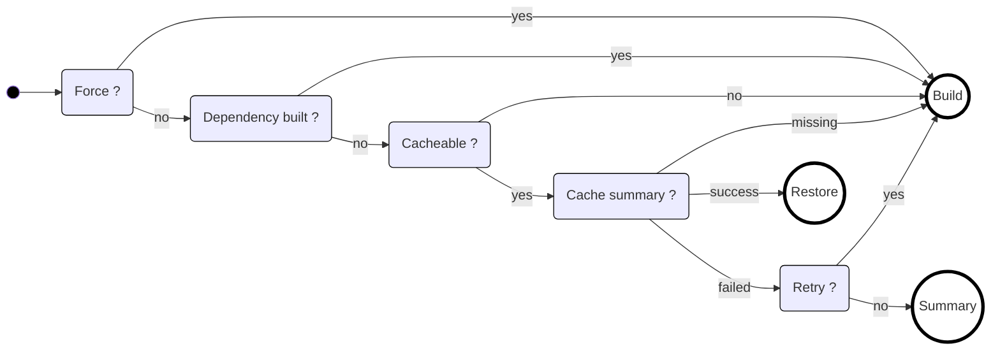

Caching is what makes Terrabuild fast. Once you understand the [build graph](/docs/getting-started/graph), caching is the next piece: it's how Terrabuild avoids building unchanged projects.

## How Caching Works

For each task in the build graph, Terrabuild computes a unique cache key (hash) from:

- **Project files** - Content is hashed (not timestamps), so same files = same hash
- **Dependencies** - If a dependency changes, the hash changes
- **Commands and arguments** - Different build commands = different hash
- **Variables** - Build variables affect the hash

This creates a [Merkle tree](https://en.wikipedia.org/wiki/Merkle_tree) structure: any change to inputs produces a new hash, automatically invalidating the cache when needed.

## Cache Key Properties

Cache keys are:

- **Deterministic** - Same inputs always produce the same key
- **Branch-agnostic** - Same content across branches produces the same key (unless using commit-specific [variables](/docs/expression/predefined-variables/) like `terrabuild.head_commit`)
- **Comprehensive** - Any change affecting output changes the key

This means builds can be shared across branches, team members, and CI/CD pipelines when nothing has changed.

## Local vs Remote Cache

### Local Cache

Terrabuild maintains a local cache in your workspace or home directory. This cache:
- Stores build artifacts for fast local builds
- Works offline
- Is specific to your machine

### Remote Cache (Insights)

When connected to [Insights](https://insights.magnusopera.io), Terrabuild can share caches:
- **Across team members** - Your teammate's build can be reused by you
- **Across CI/CD pipelines** - CI builds can reuse local builds and vice versa
- **Across branches** - Same code on different branches shares cache

This dramatically speeds up builds, especially in CI/CD where most code hasn't changed.

## Cache Invalidation

Caches are invalidated (and tasks built) when:

- File contents change (hash changes)
- Dependencies change (dependency hash changes)
- Commands or arguments change
- Variables change (if used in hash computation)
- `--force` flag is used
- `build = ~always` is set on a target

## Build, Restore, or Summary Decision

For each task, Terrabuild decides whether to **Build** (execute commands), **Restore** (recover from cache), or **Summary** (report a previous failed cached run):

| Condition | Description |
|-----------|-------------|
| `Force` | Either `--force` or `build = ~always` is enabled |
| `Dependency built` | A non-lazy dependency must build |
| `Cacheable` | The target has cacheable artifacts |
| `Cache summary` | Existing cache metadata is missing, successful, or failed |
| `Retry` | `--retry` is enabled for a failed cache summary |

Successful cache summaries restore outputs. Failed cache summaries report the previous failure as `Summary` unless `--retry` is used, in which case the task builds again.

## Optimizing Cache Usage

To maximize cache hits:

1. **Use consistent variables** - Avoid using commit-specific variables unless necessary
2. **Minimize file changes** - Only track files that affect the build (use `includes`/`ignores`)
3. **Connect to Insights** - Enable remote cache sharing for team and CI/CD
4. **Avoid `--force`** - Only use when you need to invalidate cache

## How This All Fits Together

The graph structure you learned about earlier enables this caching system. When Terrabuild builds the graph, it can check each node's cache key and decide whether to build, restore, or report a previous failed summary. This is why most builds are fast - most projects have not changed.
