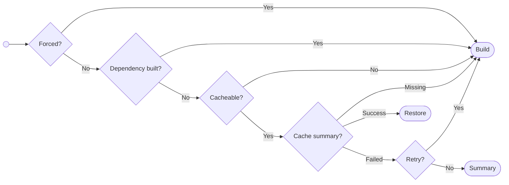

Once Terrabuild has selected and scheduled the [tasks](/docs/getting-started/tasks) in a build graph, caching determines which results can be reused instead of executed again.

## How caching works

For each task in the build graph, Terrabuild computes a unique cache key (hash) from:

- tracked project file contents
- dependency fingerprints
- resolved commands and arguments
- evaluated inputs used by the target

Dependency fingerprints form a [Merkle tree](https://en.wikipedia.org/wiki/Merkle_tree). A changed tracked input produces a different key for the affected task and its dependents.

## What a cache key covers

The same declared inputs produce the same key. A branch name or commit does not affect the key unless the target consumes a corresponding [predefined variable](/docs/expression/predefined-variables/) and opts in with `environment_sensitive = true`.

A key cannot include an input Terrabuild does not know about. Files excluded by `ignores`, host environment variables that are not forwarded, current time, network responses, and external service state require deliberate configuration or a non-cacheable target. Use `includes`, extension variables, and environment-sensitive inputs to describe values that affect output.

## Local and remote cache

### Local cache

Terrabuild maintains a local cache under `~/.terrabuild/cache`. This cache:
- Stores build artifacts for fast local builds
- Works offline
- Is specific to your machine

### Remote cache with Insights

When connected to [Insights](https://insights.magnusopera.io), Terrabuild can upload encrypted managed artifacts. Another developer machine or CI runner can restore them when it computes the same key and has access to the workspace.

## Artifact modes

Targets control where their outputs are managed through the `artifacts` setting:

- `~none`: do not cache outputs
- `~workspace`: store outputs in the local cache
- `~managed`: store outputs in the encrypted Insights cache when connected
- `~external`: the action manages its artifacts externally; Terrabuild keeps the summary

See the [Target Block reference](/docs/project/target) for target-level configuration.

## Cache invalidation

Caches are invalidated (and tasks built) when:

- File contents change (hash changes)
- Dependencies change (dependency hash changes)
- Commands or arguments change
- Variables change (if used in hash computation)
- `--force` flag is used
- `build = ~always` is set on a target

## Build, restore, or summary

For each task, Terrabuild decides whether to **Build** (execute commands), **Restore** (recover from cache), or **Summary** (report a previous failed cached run):

```mermaid
flowchart LR
  start((" ")) --> force{"Forced?"}
  force -->|Yes| build(["Build"])
  force -->|No| dependency{"Dependency built?"}
  dependency -->|Yes| build
  dependency -->|No| cacheable{"Cacheable?"}
  cacheable -->|No| build
  cacheable -->|Yes| cache{"Cache summary?"}
  cache -->|Missing| build
  cache -->|Success| restore(["Restore"])
  cache -->|Failed| retry{"Retry?"}
  retry -->|Yes| build
  retry -->|No| summary(["Summary"])

  class start tb-start
  class force,dependency,cacheable,cache,retry tb-decision
  class build tb-primary
  class restore tb-success
  class summary tb-muted
```

| Condition | Description |
|-----------|-------------|
| `Force` | Either `--force` or `build = ~always` is enabled |
| `Dependency built` | A non-lazy dependency must build |
| `Cacheable` | The target has cacheable artifacts |
| `Cache summary` | Existing cache metadata is missing, successful, or failed |
| `Retry` | `--retry` is enabled for a failed cache summary |

Successful cache summaries restore outputs. Failed cache summaries report the previous failure as `Summary` unless `--retry` is used, in which case the task builds again.

## Improve cache reuse

To improve cache reuse:

1. Keep variables stable when they do not affect output.
2. Track only the files the target reads, using `includes` and `ignores` where discovery needs correction.
3. Reserve `--force` for runs that must bypass a valid cache entry.
4. Connect to Insights when machines need to share managed artifacts.

Use `terrabuild explain <target>` to inspect the evaluated inputs, cache key, and action selected for each node.
