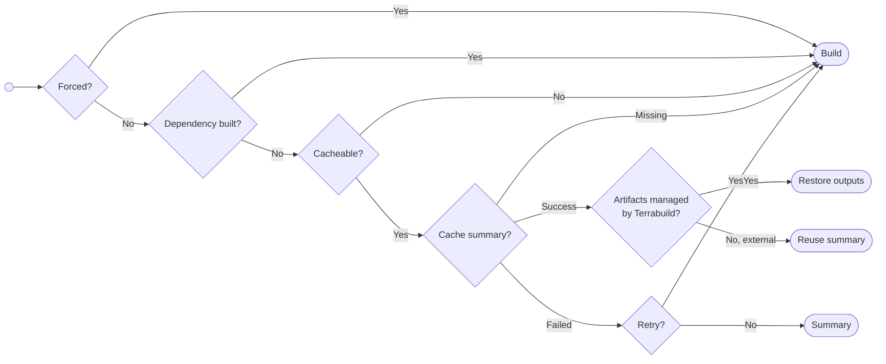

Once Terrabuild has selected and scheduled the [tasks](/docs/getting-started/tasks) in a build graph, caching determines which results can be reused instead of executed again.

## How caching works

For each task in the build graph, Terrabuild computes a unique cache key (hash) from:

- tracked project file contents
- dependency fingerprints
- resolved commands and arguments
- evaluated inputs used by the target
- a one-way aggregate fingerprint of host environment values selected through extension `variables`

Dependency fingerprints form a [Merkle tree](https://en.wikipedia.org/wiki/Merkle_tree). A changed tracked input produces a different key for the affected task and its dependents.

## What a cache key covers

The same declared inputs produce the same key. A branch name or commit does not affect the key unless the target consumes a corresponding [predefined variable](/docs/expression/predefined-variables/) and opts in with `environment_sensitive = true`.

A key cannot include an input Terrabuild does not know about. Files excluded by `ignores`, undeclared host environment variables, current time, network responses, and external service state require deliberate configuration or a non-cacheable target. Use `includes`, extension `variables`, and environment-sensitive inputs to describe values that affect output. Terrabuild hashes the names and values matched by extension `variables` into one fingerprint. Their plaintext values are passed through the container engine's process environment—even when `$TERRABUILD_HOME` must be expanded—and are never rendered, stored, or reported.

## Local and remote cache

### Local cache

Terrabuild maintains a local cache under `~/.terrabuild/cache`. This cache:

- Stores build artifacts for fast local builds
- Works offline
- Is specific to your machine

### Remote cache with Insights

When connected to [Insights](https://insights.magnusopera.io), Terrabuild can upload encrypted managed artifacts. Another developer machine or CI runner can restore them when it computes the same key and has access to the workspace.

Remote artifact reuse is an optimization, not a prerequisite for execution. If an artifact object is missing, corrupt, unreadable, or cannot be transferred, the lookup becomes a cache miss and Terrabuild executes the target locally. If an artifact upload fails after execution, the completed local cache entry remains usable; that generation simply is not shared with other machines.

This artifact policy is separate from the Insights connection lifecycle. Insights is optional to configure, but once a run prints `Connected to Insights`, its build, graph, artifact-metadata, and completion reporting are mandatory. Reporting failures fail the command rather than leaving an apparently successful but incomplete Insights run. See [Insights](/docs/getting-started/insights#what-insights-adds).

## Artifact modes

Choose an artifact mode according to who owns the reusable result, not only according to where a cache happens to be available:

| Mode | What Terrabuild retains | Choose it when | Example |
|------|--------------------------|----------------|---------|
| `~none` | No reusable summary or output files | The operation is a side effect that must execute whenever selected. | Apply infrastructure or start a development server. |
| `~workspace` | Summary, logs, and declared outputs in the local cache | Reuse is useful on this machine, but sharing the files is unnecessary or inappropriate. | Large generated sources or private intermediate output. |
| `~managed` | Summary, logs, and declared outputs locally and in encrypted Insights storage when connected | Developers and CI should be able to restore the same files. | Compiled assemblies, web bundles, or distributable archives. |
| `~external` | Execution summary and logs, but no restorable artifact files | Another system owns the artifact and Terrabuild only needs to know that publication succeeded. | A Docker image in a registry or a package published to NuGet or npm. |

The target's `outputs` patterns define the files stored for `~workspace` and `~managed`. A cached output state distinguishes targets that do not manage files, managed snapshots that are intentionally empty, and snapshots with stored files. Restoring an empty snapshot removes stale files matching the declared outputs. Output replacement is transactional: Terrabuild keeps the previous declared files until the new snapshot is installed, and the next Terrabuild invocation rolls an interrupted transaction back before reading configuration or hashing project files—even when the new plan chooses execution instead of restoration. When a successful summary says that stored outputs exist but the corresponding archive is unavailable, Terrabuild executes the target again instead of reporting a restore that cannot be completed.

`artifacts` and `build` answer different questions. Artifact mode controls whether a result can be retained and restored. Build mode controls when execution is required and whether dependency execution propagates to dependents. For example, `artifacts = ~external` normally reuses a successful publication summary, while `build = ~always` deliberately executes again despite that summary.

See [Target policies](./target-policies) for the complete decision model and the [Target Block reference](/docs/project/target) for syntax.

## Common caching policies

### Share ordinary build outputs

```hcl
target build {
  build = ~auto
  artifacts = ~managed
  outputs = [ "dist/**" ]
}
```

Use this for deterministic files that should move between developer machines and CI. A matching local entry is reused immediately; when Insights is connected, another authorized machine can download the encrypted entry.

### Keep generated files local

```hcl
target generate {
  build = ~lazy
  artifacts = ~workspace
  outputs = [ "generated/**" ]
}
```

Use this when regeneration is expensive but the files are machine-specific, sensitive, very large, or simply not useful to other machines. `~lazy` is independent of the storage choice: it prevents generator execution from forcing reusable dependents to rebuild.

### Track an externally managed artifact

```hcl
target image {
  build = ~auto
  artifacts = ~external
  depends_on = [ target.build ]
}
```

Use this when a Docker registry, package feed, or external service retains the actual artifact. On a matching successful cache entry, Terrabuild trusts the recorded execution summary and performs no file restoration. Use `--force` when the external artifact must be recreated even though its declared inputs are unchanged.

### Never reuse a side effect

```hcl
target deploy {
  build = ~always
  artifacts = ~none
  depends_on = [ target.plan ]
}
```

Use this for work whose purpose is the action itself rather than a reusable result. The target executes whenever selected and does not create a cache entry that a later run could mistake for completion of a new deployment.

## Cache invalidation

Caches are invalidated (and tasks built) when:

- File contents change (hash changes)
- Dependencies change (dependency hash changes)
- Commands or arguments change
- Variables change (if used in hash computation)
- `--force` flag is used
- `build = ~always` is set on a target

## Build, restore, or summary

For each task, Terrabuild decides whether to **Build** (execute commands), **Restore** (recover Terrabuild-managed outputs), or reuse a cached **Summary**. A successful external summary needs no file restoration because the artifact remains in its registry or external service. A failed summary reports the previous failure without rerunning it.


```mermaid
flowchart LR
  start((" ")) --> force{"Forced?"}
  force -->|Yes| build(["Build"])
  force -->|No| dependency{"Dependency built?"}
  dependency -->|Yes| build
  dependency -->|No| cacheable{"Cacheable?"}
  cacheable -->|No| build
  cacheable -->|Yes| cache{"Cache summary?"}
  cache -->|Missing| build
  cache -->|Success| ownership{"Artifacts managed<br/>by Terrabuild?"}
  ownership -->|Yes| restore(["Restore outputs"])
  ownership -->|No, external| reuse(["Reuse summary"])
  cache -->|Failed| retry{"Retry?"}
  retry -->|Yes| build
  retry -->|No| summary(["Summary"])

  class start tb-start
  class force,dependency,cacheable,cache,ownership,retry tb-decision
  class build tb-primary
  class restore tb-success
  class reuse,summary tb-muted
```

| Condition | Description |
|-----------|-------------|
| `Force` | Either `--force` or `build = ~always` is enabled |
| `Dependency built` | A non-lazy dependency must build |
| `Cacheable` | The target has cacheable artifacts |
| `Cache summary` | Existing cache metadata is missing, successful, or failed |
| `Artifacts managed by Terrabuild` | `~workspace` and `~managed` restore declared files; `~external` leaves the artifact in its external store |
| `Retry` | `--retry` is enabled for a failed cache summary |

Successful `~workspace` and `~managed` cache summaries restore declared outputs when required. A successful `~external` summary is sufficient by itself: Terrabuild never tries to download the Docker image, package, or other externally managed artifact. Failed cache summaries report the previous failure as `Summary` unless `--retry` is used, in which case the task builds again.

## Improve cache reuse

To improve cache reuse:

1. Keep variables stable when they do not affect output.
2. Track only the files the target reads, using `includes` and `ignores` where discovery needs correction.
3. Reserve `--force` for runs that must bypass a valid cache entry.
4. Connect to Insights when machines need to share managed artifacts.
5. Use `~external` only when the external system makes the artifact available independently of Terrabuild.

Use `terrabuild explain <target>` to inspect the evaluated inputs, cache key, and action selected for each node.
