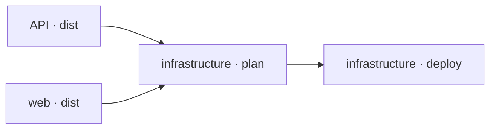

After [configuring environments](./environments.md), connect application outputs
to the infrastructure that deploys them. Terrabuild uses the same coordination
model for this work. Deployment is the
right-hand side of the same graph that builds and packages the applications.



This gives Terrabuild enough context to answer a useful question: before this
environment can change, which application results must exist?

## Before you start

This guide is a configuration pattern for an existing deployment. It assumes:

- `api` and `web` are Terrabuild projects with working `dist` targets;
- those targets publish artifacts under versions that Terraform can consume;
- `src/deploy` contains Terraform configuration with `environment`, `api_version`,
  and `web_version` input variables;
- the backend and credentials are configured for each intended environment.

The snippets form one shared target policy in `WORKSPACE` and one infrastructure
`PROJECT`. They do not provision a cloud account or supply the Terraform resources.

## Connect infrastructure to applications

The infrastructure project names the applications whose outputs it deploys:

```terrabuild title="src/deploy/PROJECT"
project infrastructure {
  depends_on = [ project.api project.web ]
  environments = [ "staging" "production" ]
  @terraform { }
}
```

That project relationship connects application changes to infrastructure. The
workspace then connects the named outcomes:

```terrabuild title="WORKSPACE"
target dist {
  depends_on = [ target.build target.^build ]
}

target plan {
  depends_on = [ target.^dist ]
  environment_sensitive = true
  build = ~always
  artifacts = ~workspace
}

target deploy {
  depends_on = [ target.plan ]
  environment_sensitive = true
  build = ~always
  artifacts = ~none
}
```

Read the declarations from the requested outcome backwards:

- `deploy` requires the current project's `plan`;
- `plan` requires `dist` from upstream application projects;
- `dist` requires the relevant builds.

The Terraform commands remain in the infrastructure `PROJECT`:

```terrabuild title="src/deploy/PROJECT"
target plan {
  @terraform init { config = "backend.${terrabuild.environment}.config" }
  @terraform plan {
    variables = {
      environment: terrabuild.environment
      api_version: project.api.version
      web_version: project.web.version
    }
  }
}

target deploy {
  @terraform init { config = "backend.${terrabuild.environment}.config" }
  @terraform apply { }
}
```

Provide `backend.staging.config` and `backend.production.config` beside the
Terraform configuration. Their contents depend on your chosen backend and must
select the intended state location. The selected environment is interpolated
into the filename; passing `--environment` alone would not switch Terraform state.
If your team uses Terraform workspaces instead, explicitly select the same
workspace during both planning and applying.

`project.api.version` and `project.web.version` are Terrabuild project hashes.
The publication targets and Terraform configuration must agree on how those
hashes identify images or packages.

Terraform still reads and changes infrastructure. Terrabuild makes sure the
application artifacts and plan are ready before Terraform applies them.

## Inspect before executing

Resolve the complete path without running any command:

```bash
terrabuild explain deploy --environment staging
```

Confirm that the expected application distributions, staging plan, and final
deployment are present. This is a safe way to review a new dependency model or
CI selection.

## Plan, then deploy

After configuring the Terraform backend and credentials, create a plan:

```bash
terrabuild run plan --environment staging
```

To create a fresh plan and apply the deployment:

```bash
terrabuild run deploy --environment staging
```

The second command resolves the same prerequisites. Valid application outputs
can be reused; missing or changed outputs run again. This example deliberately
reruns `plan` so Terraform observes current external state before applying it.
The deployment waits until every required result succeeds.

If your workflow requires approval of an exact saved plan, the two commands above
are not that approval handoff: `run deploy` produces a new plan. See
[reviewed plan identity](./advanced-scenarios.md#observe-live-state-before-applying-infrastructure)
for the distinction.

## Why the policies differ

A plan depends on configuration, the selected environment, and live infrastructure
state. A source cache key cannot detect changes made outside the repository.
`build = ~always` therefore refreshes this example's plan on every request.
`artifacts = ~workspace` retains its generated file locally; storing that file
and deciding whether to execute again are separate policies.

Use `~managed` when authorized machines should share the encrypted plan through
Insights. Use a reusable plan policy only when its freshness and review lifecycle
are controlled by your workflow.

A deployment is different: its value is the external action itself. Therefore:

- `build = ~always` executes it whenever selected;
- `artifacts = ~none` prevents a prior deployment record from satisfying a new request.

Terrabuild does not inspect the live cloud environment and claim that it still
matches an earlier deployment. Terraform and its provider remain responsible
for external state.

The
[Target policies](./target-policies.md) deep dive covers other build modes,
artifact ownership, batching, sensitive inputs, and locks.

## CI still owns control of the environment

Terrabuild owns selection and dependency order. CI should continue to own:

- repository triggers;
- credentials and protected secrets;
- approvals;
- concurrency rules;
- access to staging and production.

This keeps delivery relationships in the repository while preserving the
security boundary of the CI system.
