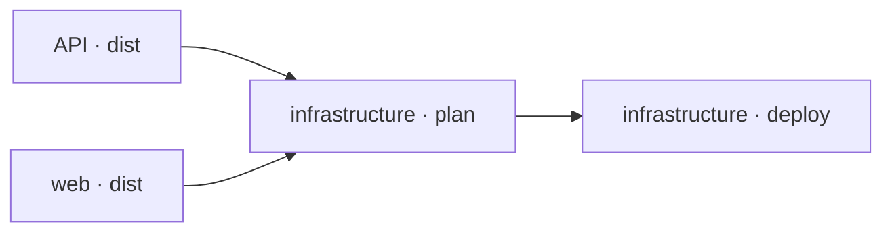

Terrabuild does not switch into a separate deployment mode. Deployment is the
right-hand side of the same graph that builds and packages the applications.



This gives Terrabuild enough context to answer a useful question: before this
environment can change, which application results must exist?

## Connect infrastructure to applications

The infrastructure project names the applications whose outputs it deploys:

```hcl {filename="src/deploy/PROJECT"}
project infrastructure {
  depends_on = [ project.api project.web ]
  environments = [ "staging" "production" ]
  @terraform { }
}
```

That project relationship connects application changes to infrastructure. The
workspace then connects the named outcomes:

```hcl {filename="WORKSPACE"}
target dist {
  depends_on = [ target.build target.^build ]
}

target plan {
  depends_on = [ target.^dist ]
  environment_sensitive = true
  artifacts = ~workspace
}

target deploy {
  depends_on = [ target.plan ]
  build = ~always
  artifacts = ~none
}
```

Read the declarations from the requested outcome backwards:

- `deploy` requires the current project's `plan`;
- `plan` requires `dist` from upstream application projects;
- `dist` requires the relevant builds.

The Terraform commands remain in the infrastructure `PROJECT`:

```hcl {filename="src/deploy/PROJECT"}
target plan {
  @terraform init { }
  @terraform plan {
    variables = {
      environment: terrabuild.environment
      api_version: project.api.version
      web_version: project.web.version
    }
  }
}

target deploy {
  @terraform init { }
  @terraform apply { }
}
```

Terraform still reads and changes infrastructure. Terrabuild makes sure the
application artifacts and plan are ready before Terraform applies them.

## Inspect before executing

Resolve the complete path without running any command:

```bash
terrabuild explain deploy --environment staging
```

Confirm that the expected application distributions, staging plan, and final
deployment are present. This is a safe way to review a new dependency model or
CI selection.

## Plan, then deploy

After configuring the Terraform backend and credentials, create a plan:

```bash
terrabuild run plan --environment staging
```

Then apply the deployment:

```bash
terrabuild run deploy --environment staging
```

The second command resolves the same prerequisites. Valid application outputs
can be reused; missing or changed outputs run again. The deployment waits until
every required result succeeds.

## Why the policies differ

A plan is a repeatable file tied to its inputs and selected environment. The
example keeps it in this machine's workspace cache with `~workspace`. Use
`~managed` when authorized machines should share the encrypted plan through
Insights.

A deployment is different: its value is the external action itself. Therefore:

- `build = ~always` executes it whenever selected;
- `artifacts = ~none` prevents a prior deployment record from satisfying a new request.

Terrabuild does not inspect the live cloud environment and claim that it still
matches an earlier deployment. Terraform and its provider remain responsible
for external state.

These are the only policies you need for this example. The
[Target policies](./target-policies.md) deep dive covers other build modes,
artifact ownership, batching, sensitive inputs, and locks.

## CI still owns control of the environment

Terrabuild owns selection and dependency order. CI should continue to own:

- repository triggers;
- credentials and protected secrets;
- approvals;
- concurrency rules;
- access to staging and production.

This keeps delivery relationships in the repository while preserving the
security boundary of the CI system.
