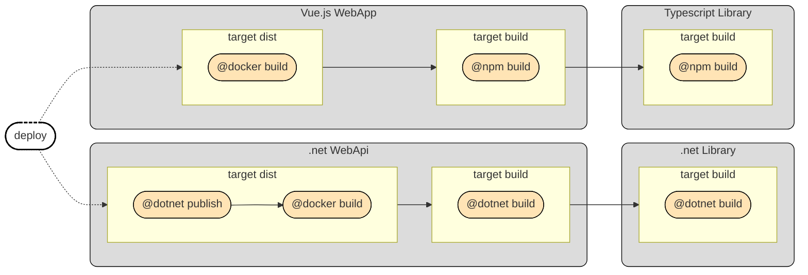
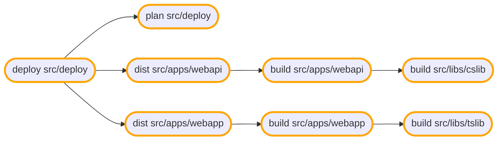

At the heart of Terrabuild is a **DAG (Directed Acyclic Graph)** that represents your entire build. Understanding this graph is key to understanding how Terrabuild works.

## What is the Build Graph?

When you run `terrabuild run <target>`, Terrabuild analyzes your workspace and builds a graph where:

- **Nodes** represent tasks (e.g., "build project A's build target")
- **Edges** represent dependencies (e.g., "project A depends on project B")
- The graph is **directed** - dependencies flow in one direction
- The graph is **acyclic** - no circular dependencies are allowed

This graph structure enables Terrabuild to:
- Determine what needs to be built and in what order
- Identify what can be built in parallel
- Skip building unchanged projects
- Use cached artifacts when available

## Example: How Projects Become a Graph

The following example shows how multiple projects with dependencies become a build graph. Each project has its own `PROJECT` file, and dependencies are typically discovered automatically by Terrabuild's extensions (though you can also specify them explicitly).

This example is from the [Terrabuild Playground](https://github.com/MagnusOpera/Terrabuild-Playground) - a sample workspace you can use to experiment.

Build graph is as follow:

## How the Graph Enables Fast Builds

The graph structure enables Terrabuild's core optimization: **only build what changed**.

When you run a build:
1. Terrabuild checks each node in the graph
2. If a project's files or dependencies changed, that project needs building
3. If nothing changed, the project can be restored from cache (see [Caching](/docs/getting-started/caching))
4. Dependent projects are automatically marked for build if their dependencies changed

This means:
- **Most builds are fast** - Only changed projects are built
- **Branches share cache** - Same code on different branches reuses cache
- **Dependencies are handled automatically** - If a library changes, apps using it are built

The graph is what makes Terrabuild efficient for monorepos. Even with hundreds of projects, you typically only build a handful on each change.
