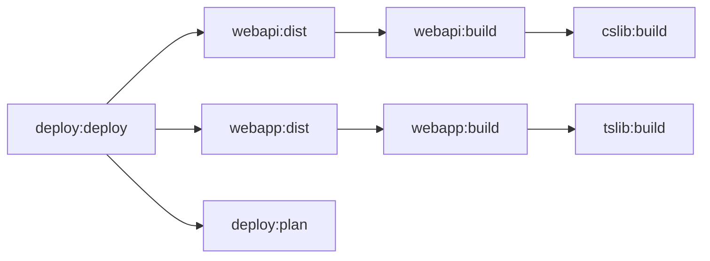

At the heart of Terrabuild is a **DAG (Directed Acyclic Graph)** that represents your entire build. Understanding this graph is key to understanding how Terrabuild works.

## What is the Build Graph?

When you run `terrabuild run <target>`, Terrabuild analyzes your workspace and builds a graph where:

- **Nodes** represent tasks (e.g., "build project A's build target")
- **Edges** represent dependencies (e.g., "project A depends on project B")
- The graph is **directed** - dependencies flow in one direction
- The graph is **acyclic** - no circular dependencies are allowed

This graph structure enables Terrabuild to:
- Determine what needs to be built and in what order
- Identify what can be built in parallel
- Skip building unchanged projects
- Use cached artifacts when available

## How Terrabuild Constructs the Graph

Graph construction happens before any target command runs:

1. Terrabuild reads `WORKSPACE` and `PROJECT` files.
2. It builds the full graph for all configured project targets.
3. It selects the requested targets and the dependencies reachable from them.
4. It resolves extension commands, cacheability, outputs, hashes, and batch compatibility.
5. It assigns each node an action: build, restore, or report a previous failed summary.
6. It marks the required nodes and adds any valid batch nodes.
7. The runner receives the final graph and starts executing only then.

This means target dependencies, selected project filters, cache status, lazy targets, and batch constraints are all settled before execution begins.

Dependency references are permissive by project:

- `target.^build` adds the `build` target on upstream dependency projects that define it.
- `target.build` adds the `build` target on the current project only when that project defines it.

Circular target dependency chains are rejected during graph construction and reported with the cycle path.

## Example: How Projects Become a Graph

The following example shows how multiple projects with dependencies become a build graph. Each project has its own `PROJECT` file, and dependencies are typically discovered automatically by Terrabuild's extensions (though you can also specify them explicitly).

This example is from the [Terrabuild Playground](https://github.com/MagnusOpera/Terrabuild-Playground) - a sample workspace you can use to experiment.

Selecting `deploy` produces a task graph like this:

Arrows point from a dependent task to the prerequisite it requires. The runner executes prerequisites first.

## How the Graph Enables Fast Builds

The graph structure enables Terrabuild's core optimization: **only build what changed**.

When you run a build:
1. Terrabuild checks each node in the graph
2. If a node is forced, uncached, non-cacheable, or depends on a non-lazy node that must build, that node builds
3. If a successful cache summary exists, the node can be restored from cache (see [Caching](/docs/getting-started/caching))
4. If a failed cache summary exists, the failure is reported unless `--retry` is used
5. Dependent projects are automatically marked for build if their dependencies changed

This means:
- **Most builds are fast** - Only changed projects are built
- **Branches share cache** - Same code on different branches reuses cache
- **Dependencies are handled automatically** - If a library changes, apps using it are built

The graph is what makes Terrabuild efficient for monorepos. Even with hundreds of projects, you typically only build a handful on each change.
