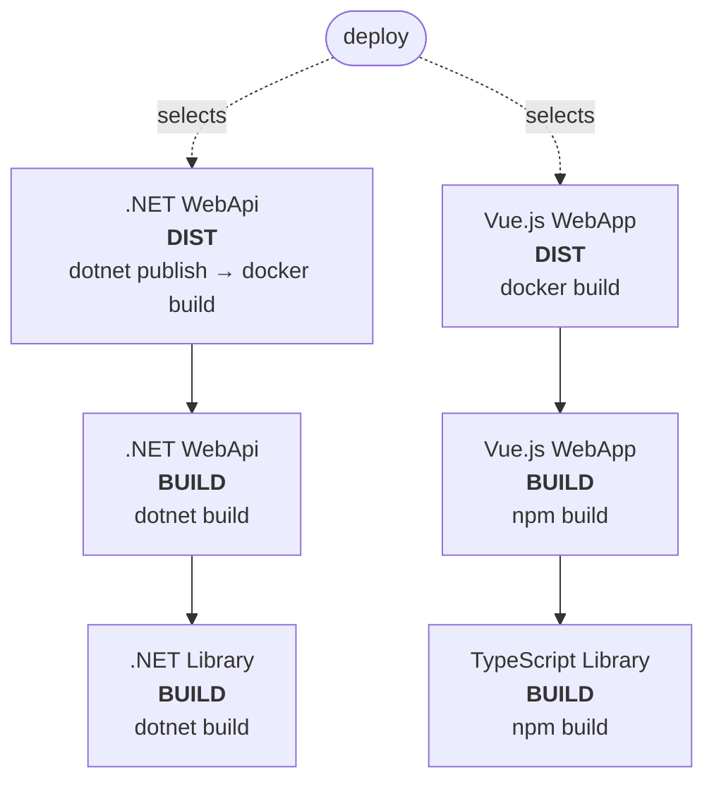
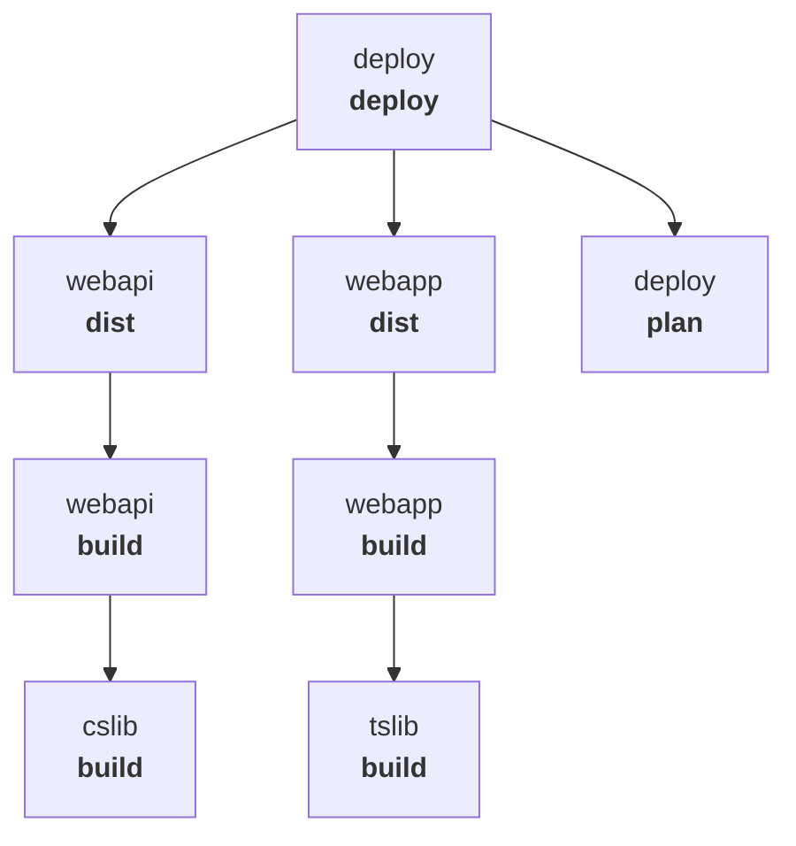

Terrabuild represents each run as a directed acyclic graph, or DAG. The graph contains the selected targets and every prerequisite Terrabuild must consider before it can run them.

## What the graph contains

When you run `terrabuild run <target>`, Terrabuild analyzes your workspace and builds a graph where:

- Nodes represent tasks, such as the `build` target for project A.
- Edges represent dependencies between tasks.
- Edges have a direction. A dependent node points to the prerequisite it requires.
- Circular dependency chains are invalid.

Terrabuild uses these relationships to order work and identify independent tasks that can run in parallel. Cache fingerprints determine whether a selected task executes or restores saved output.

## How Terrabuild constructs the graph

Graph construction happens before any target command runs:

1. Terrabuild reads `WORKSPACE` and `PROJECT` files.
2. It builds the full graph for all configured project targets.
3. It selects the requested targets and the dependencies reachable from them.
4. It resolves extension commands, cacheability, outputs, hashes, and batch compatibility.
5. It assigns each node an action: build, restore, or report a previous failed summary.
6. It marks the required nodes and adds any valid batch nodes.
7. The runner receives the final graph and starts executing only then.

This means target dependencies, selected project filters, cache status, lazy targets, and batch constraints are all settled before execution begins.

Dependency references are permissive by project:

- `target.^build` adds the `build` target on upstream dependency projects that define it.
- `target.build` adds the `build` target on the current project only when that project defines it.

Circular target dependency chains are rejected during graph construction and reported with the cycle path.

## How projects become a graph

This example has two applications and one library behind each application. Extensions can discover project dependencies, and a `PROJECT` file can also declare them explicitly.

The configuration comes from the [Terrabuild Playground](https://github.com/MagnusOpera/Terrabuild-Playground).

```mermaid
flowchart TB
  deploy(["deploy"])
  apiDist[".NET WebApi<br/><b>DIST</b><br/>dotnet publish → docker build"]
  webDist["Vue.js WebApp<br/><b>DIST</b><br/>docker build"]
  apiBuild[".NET WebApi<br/><b>BUILD</b><br/>dotnet build"]
  webBuild["Vue.js WebApp<br/><b>BUILD</b><br/>npm build"]
  csBuild[".NET Library<br/><b>BUILD</b><br/>dotnet build"]
  tsBuild["TypeScript Library<br/><b>BUILD</b><br/>npm build"]

  deploy -. selects .-> apiDist
  deploy -. selects .-> webDist
  apiDist --> apiBuild --> csBuild
  webDist --> webBuild --> tsBuild

  class deploy tb-primary
  class apiDist,webDist tb-success
  class apiBuild,webBuild tb-secondary
  class csBuild,tsBuild tb-muted
```

Selecting `deploy` produces a task graph like this:

```mermaid
flowchart TB
  deploy["deploy<br/><b>deploy</b>"]
  apiDist["webapi<br/><b>dist</b>"]
  webDist["webapp<br/><b>dist</b>"]
  plan["deploy<br/><b>plan</b>"]
  apiBuild["webapi<br/><b>build</b>"]
  webBuild["webapp<br/><b>build</b>"]
  csBuild["cslib<br/><b>build</b>"]
  tsBuild["tslib<br/><b>build</b>"]

  deploy --> apiDist & webDist & plan
  apiDist --> apiBuild --> csBuild
  webDist --> webBuild --> tsBuild

  class deploy tb-primary
  class apiDist,webDist,plan tb-success
  class apiBuild,webBuild tb-secondary
  class csBuild,tsBuild tb-muted
```

Arrows point from a dependent task to the prerequisite it requires. The runner executes prerequisites first.

## How changes affect a run

The graph defines which tasks can affect one another. Fingerprints and cache state decide the action assigned to each selected node.

1. A forced, non-cacheable, or uncached node executes.
2. A node with a successful matching cache entry can restore its outputs.
3. A node with a failed cache summary reports that failure unless the run uses `--retry`.
4. When a non-lazy prerequisite executes, Terrabuild also executes the dependent work required by the graph.

Cache reuse depends on declared inputs. Branches and machines can reuse an entry only when they produce the same fingerprint and can access the stored artifacts. See [Caching](/docs/getting-started/caching) for the inputs and exclusions that matter.
