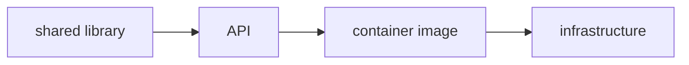

Terrabuild starts with an outcome, not a list of CI steps.

```bash
terrabuild run dist
terrabuild run deploy --environment staging
```

`dist` and `deploy` are **targets**: named outcomes available in the repository.
The selected environment adds the context in which an outcome should be
reached.

## A repository is a set of connected projects

A Terrabuild **project** is a unit that can produce something: a library, an
application, a container image, generated code, or an infrastructure plan.

Projects declare their dependencies. If an application consumes a shared
library, Terrabuild knows that the library belongs before the application in the
delivery path.



The relationship is useful beyond compilation. A shared-library change can flow
through the application and its image to the environment that receives it.

## Targets describe useful outcomes

Projects expose targets such as `build`, `test`, `dist`, `plan`, and `deploy`.
Targets can depend on other targets in the same project or in upstream projects.

When you request `deploy`, Terrabuild walks those relationships backwards until
it has the complete delivery path. You do not have to reproduce that path as a
sequence of CI jobs.

## Matching results are already satisfied

Terrabuild identifies repeatable work from its declared inputs. When the inputs
and dependencies still match a successful result, Terrabuild can restore its
files or reuse its recorded outcome.

Change one library and Terrabuild follows that change into the applications
that depend on it. Unrelated parts of the workspace can remain satisfied.

Deployment is different. Applying infrastructure or cleaning an environment is
an external side effect, so it should run whenever selected. Terrabuild models
that difference rather than treating every target as cacheable work.

## Your tools perform the work

Terrabuild does not replace language compilers, package managers, container
engines, or infrastructure tools. Extensions connect their existing commands to
the delivery model:

- .NET, npm, pnpm, Gradle, Cargo, and Make build and test projects;
- Docker or Podman build images;
- Terraform plans and applies infrastructure;
- FScript extensions describe repository-specific tools.

Terrabuild selects, orders, runs, and reuses those commands.

## The same declaration runs locally and in CI

The repository owns the delivery relationships. A developer can inspect or run
the same target that CI invokes.

CI still owns triggers, runners, credentials, approvals, and protected
environments. Its job can remain small:

```yaml
- run: terrabuild run build test
- run: terrabuild run deploy --environment staging
```

## Two configuration levels

Terrabuild reads two kinds of file:

- `WORKSPACE` at the monorepo root contains shared target behavior and extension defaults.
- `PROJECT` inside each buildable or deployable unit contains its commands, dependencies, and outputs.

You will see both in the [quick start](./quick-start.md). You do not need to
write them from scratch to follow the example.

## Continue

- [Install Terrabuild](./install.md)
- [Run the quick start](./quick-start.md)
- [Read the deeper concept model](./key-concepts.md) when you need the precise task and graph vocabulary
