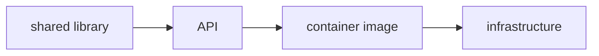

Terrabuild starts with **desired-state configuration (DSC)**: declare the outcome
that should hold, and let the engine determine the work required to reach it.
Terrabuild applies this approach across the tools and environments in your repository.

A request names the desired outcome and, when relevant, its environment:

```bash
terrabuild run dist
terrabuild run deploy --environment staging
```

`dist` and `deploy` are **targets**: named outcomes available in the repository.
The selected environment adds the context in which an outcome should be
reached.

## A repository is a set of connected projects

A Terrabuild **project** is a unit that can produce something: a library, an
application, a container image, generated code, or an infrastructure plan.

Projects declare their dependencies. If an application consumes a shared
library, the project dependency records that relationship. A target dependency
then states which library work must finish before the application runs.



The relationship is useful beyond compilation. A shared-library change can flow
through the application and its image to the environment that receives it.

## Targets describe useful outcomes

Projects expose targets such as `build`, `test`, `dist`, `plan`, and `deploy`.
Declare selectable target names in `WORKSPACE`, then supply their commands in
each participating `PROJECT`. Targets can depend on other targets in the same
project or in upstream projects.

When you request `deploy`, Terrabuild walks those relationships backwards until
it has the complete delivery path. You do not have to reproduce that path as a
sequence of CI jobs.

## Reuse results whose inputs still match

Terrabuild identifies repeatable work from its declared inputs. When the inputs
and dependencies still match a successful result, Terrabuild can restore its
files or reuse its recorded outcome.

Change one library and Terrabuild follows that change into the applications
that depend on it. Unrelated parts of the workspace can remain satisfied.

Deployment is different. Applying infrastructure or cleaning an environment is
an external side effect, so configure it with `build = ~always` and `artifacts = ~none` to run whenever
selected. A target name such as `deploy` does not enforce that policy by itself.

## Your tools perform the work

Terrabuild does not replace language compilers, package managers, container
engines, or infrastructure tools. Extensions connect their existing commands to
the delivery model:

- .NET, npm, pnpm, Gradle, Cargo, and Make build and test projects;
- Docker or Podman build images;
- infrastructure tools plan and apply changes;
- FScript extensions describe repository-specific tools.

Terrabuild selects, orders, runs, and reuses those commands.

## The same declaration runs locally and in CI

The repository owns the delivery relationships. A developer can inspect or run
the same target that CI invokes.

CI still owns triggers, runners, credentials, approvals, and protected
environments. Its job can remain small:

```yaml
- run: terrabuild run build test
- run: terrabuild run deploy --environment staging
```

## Two configuration levels

Terrabuild reads two kinds of file:

- `WORKSPACE` at the monorepo root contains shared target behavior and extension defaults.
- `PROJECT` inside each buildable or deployable unit contains its commands, dependencies, and outputs.

You will write both in the [first workflow tutorial](./quick-start.md), using
small shell scripts before adding a language-specific toolchain.

## Environments supply context

A deployment may select staging-specific projects, supply a region or backend,
and produce a plan tied to that environment. A build that uses none of those
settings can remain reusable across environments. Declare sensitive consumers
explicitly rather than duplicating the entire workflow.

[Configure environments](./environments.md) introduces each mechanism with a
small runnable example.

## Extend the vocabulary with FScript

Included extensions provide actions for common tools. Configure their defaults
or container images first. When you need another integration, an FScript file can
expose your own actions and translate them into commands. Terrabuild applies the
same dependency and reuse rules to both kinds of extension.

## What “desired state” means here

The desired state is expressed by your requested targets, their prerequisites,
and their policies. A matching build result may already satisfy a prerequisite;
a deployment configured to always run still needs its external action.

Terrabuild evaluates this model on each invocation. The underlying tools observe
and change the systems they own. Terrabuild coordinates their results with
application artifacts and environment settings. A cached build result does not
independently certify the current state of an external system.

## Continue

- [Install Terrabuild](./install.md)
- [Run the quick start](./quick-start.md)
- [Read the deeper concept model](./key-concepts.md) when you need the precise task and graph vocabulary
