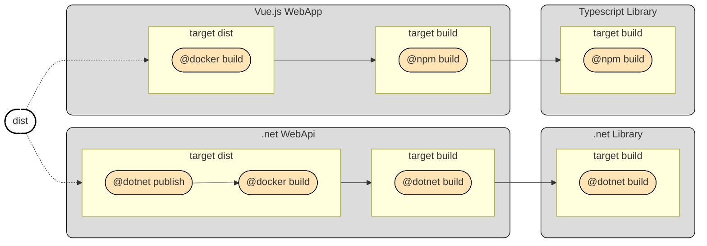

This hands-on guide walks you through using Terrabuild with a real example. You'll see how projects, dependencies, targets, and caching work together.

**Prerequisites**: Terrabuild installed and Docker running.

**Get Started**: Clone the [Terrabuild Playground](https://github.com/MagnusOpera/terrabuild-playground) repository to follow along.

The playground repository defines following projects and dependencies:



## Running Your First Build

To build the entire workspace, run:

```bash
terrabuild run dist
```

This command:
1. Discovers all projects in the workspace
2. Builds the dependency graph
3. Checks cache for each project
4. Builds only what changed (or everything on first run)
5. Executes tasks in parallel where possible

**Try it**: After the first build, modify a file in one project and run again. Notice how only that project and its dependents build, everything else is restored from cache!

## Understanding the Configuration

Here's how the playground workspace is configured. This shows the key concepts in action:
``` {filename="WORKSPACE"}
# require all dependencies to be built before building this target
target build {
    depends_on = [ target.^build ]
}

# dist requires project to be built before proceeding
target dist {
    depends_on = [ target.build ]
}

# default variables for targets
variable config {
    description = "configuration to build"
    default = "Debug"
}

# .net sdk version is forced and build is happening in a container
# no need to install .net sdk on developer machines
# also the default values define the target configuration
extension @dotnet {
    image = "mcr.microsoft.com/dotnet/sdk:8.0"
    defaults {
        configuration = var.config
    }
}

# nodejs version is forced and build is happening in a container
# no need to install nodejs on developer machines
extension @npm {
    image = "node:22"
}

# terraform version is forced and build is happening in a container
# no need to install terraform on developer machines
extension @terraform {
    image = "hashicorp/terraform:1.12"
}
```

``` {filename="src/apps/webapi"}
# configure docker extension (see Dockerfile for ARG)
extension @docker {
    defaults {
        image = "ghcr.io/magnusopera/sample/webapi"
        arguments = { configuration: var.config }
    }
}

# project is based on .net: dependency on src/libs/cslib is detected automatically
# also defines labels for scoped builds
project {
    labels = [ "app" "dotnet" ]
    @dotnet { }
}

target build {
    @dotnet build { }
}

# to build docker image we need to publish the .net project
# and then build the image on top of this (check Dockerfile)
# Docker is targetting linux/x64
target dist {
    @dotnet publish { runtime = "linux-x64" }
    @docker build { platform = "linux/amd64" }
}
```

``` {filename="src/apps/webapp"}
extension @docker {
    defaults {
        image = "ghcr.io/magnusopera/sample/webapp"
        arguments = { configuration: var.config }
    }
}

# project is based on nodejs: dependency on src/libs/tslib is detected automatically.
project {
    labels = [ "app" "web" ]
    @npm { }
}

target build {
    @npm build { }
}

target dist {
    @docker build { }
}
```

``` {filename="src/libs/cslib"}
project {
    labels = [ "lib" ]
    @dotnet { }
}

target build {
    @dotnet build
}
```

``` {filename="src/libs/tslib"}
project {
    labels = [ "lib" ]
    @npm { }
}

target build {
    @npm build
}
```

## What's Next?

You've seen Terrabuild in action! Now explore the concepts in depth:

- [Graph](/docs/getting-started/graph): Understand the build graph structure
- [Caching](/docs/getting-started/caching): Learn how caching makes builds fast
- [Tasks](/docs/getting-started/tasks): See how tasks execute

### Enable Remote Caching (Optional)

For even faster builds, especially in CI/CD, connect to [Insights](https://insights.magnusopera.io) for remote cache sharing:

1. Create an account and workspace on Insights
2. Add to your `WORKSPACE` file:
   ```
   workspace {
       id = "your-workspace-id"
   }
   ```
3. Connect using: `terrabuild login --workspace <id> --token <token>`

See [Caching](/docs/getting-started/caching) for more details.
