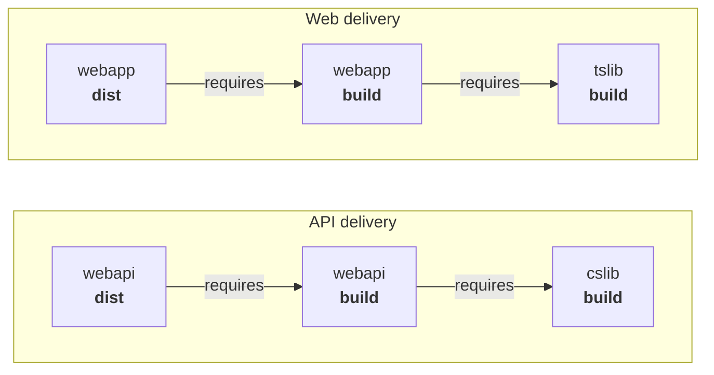

This hands-on guide walks you through using Terrabuild with a real example. You'll see how projects, dependencies, targets, and caching work together.

**Prerequisites**: Terrabuild installed and Docker running.

**Get Started**: Clone the [Terrabuild Playground](https://github.com/MagnusOpera/terrabuild-playground) repository to follow along.

The playground repository defines the following projects and dependencies. Arrows point from a task to the task it requires:



## Running Your First Build

To build the entire workspace, run:

```bash
terrabuild run dist
```

This command:

1. Discovers all projects in the workspace
2. Builds the dependency graph
3. Checks the cache for each selected task
4. Builds only what is required
5. Executes tasks in parallel where possible

**Try it**: After the first build, modify a file in one project and run again. Notice how Terrabuild rebuilds the affected tasks and restores reusable work from cache.

## Understanding the Configuration

Here is the current playground configuration, with the shared policy first and then each application or library project:

```hcl {filename="WORKSPACE"}
# build project dependencies first
target build {
    depends_on = [ target.^build ]
}

# test the current project after building it
target test {
    depends_on = [ target.build ]
}

# build distributable artifacts after the current project and its dependencies
target dist {
    depends_on = [ target.build target.^build ]
}

# deployment targets
target plan {
    build = terrabuild.retry ? ~always : ~auto
    depends_on = [ ]
}

target apply {
    depends_on = [ target.plan target.^dist ]
}

locals {
    dotnet = {
        config: terrabuild.environment ? "Release" : "Debug"
    }
    runtimes = {
        dotnet: terrabuild.ci ? "linux-x64" : "linux-arm64"
        docker: terrabuild.ci ? [ "linux/amd64" ] : [ "linux/arm64" ]
    }
    docker_tags = {
        dotnet_sdk: "9.0"
        dotnet_runtime: "9.0"
        nodejs: "22.16.0-alpine3.22"
        nginx: "1.28.0-alpine"
    }
}

extension @dotnet {
    image = "mcr.microsoft.com/dotnet/sdk:${local.docker_tags.dotnet_sdk}"
    defaults {
        runtime = local.runtimes.dotnet
        configuration = local.dotnet.config
    }
}

extension @docker {
    defaults {
        platforms = local.runtimes.docker
        image = "ghcr.io/magnusopera/${terrabuild.project}"
    }
}

extension @npm {
    image = "node:${local.docker_tags.nodejs}"
}
```

```hcl {filename="src/apps/webapi/PROJECT"}
project webapi {
    labels = [ "app" ]
    @dotnet { }
}

target build {
    @dotnet restore { dependencies = true }
    @dotnet build { dependencies = true }
}

target dist {
    @dotnet restore { dependencies = true }
    @dotnet publish { single = true build = true restore = true }
    @docker build {
        build_args = {
            dotnet_version: local.docker_tags.dotnet_runtime
            platform: local.runtimes.dotnet
            configuration: local.dotnet.config
        }
    }
}
```

```hcl {filename="src/apps/webapp/PROJECT"}
project webapp {
    labels = [ "app" ]
    ignores = [ "vite.config.js" "tsconfig.node.tsbuildinfo" "tsconfig.tsbuildinfo" ]
    @npm { }
}

target build {
    @npm build { }
}

target dist {
    @docker build {
        build_args = { nginx_version: local.docker_tags.nginx }
    }
}

target serve {
    @npm dev { }
}
```

```hcl {filename="src/libs/cslib/PROJECT"}
project {
    labels = [ "lib" "dotnet" ]
    @dotnet { }
}

target build {
    @dotnet restore { dependencies = true }
    @dotnet build { dependencies = true }
}
```

```hcl {filename="src/libs/tslib/PROJECT"}
project {
    labels = [ "lib" ]
    @npm { }
}

target build {
    @npm build { }
}
```

## What's Next?

You've seen Terrabuild in action. Build the mental model next, then explore execution in depth:

- [Key Concepts](/docs/getting-started/key-concepts): Distinguish projects, targets, tasks, and dependencies
- [Graph](/docs/getting-started/graph): Understand the build graph structure
- [Tasks](/docs/getting-started/tasks): See how tasks execute
- [Caching](/docs/getting-started/caching): Learn how caching makes builds fast

### Enable Remote Caching (Optional)

For even faster builds, especially in CI/CD, connect to [Insights](https://insights.magnusopera.io) for remote cache sharing:

1. Create an account and workspace on Insights
2. Add to your `WORKSPACE` file:
   ```
   workspace {
       id = "your-workspace-id"
   }
   ```
3. Connect using: `terrabuild login --workspace <id> --token <token> --masterkey <master-key>`

See [Caching](/docs/getting-started/caching) for more details.
