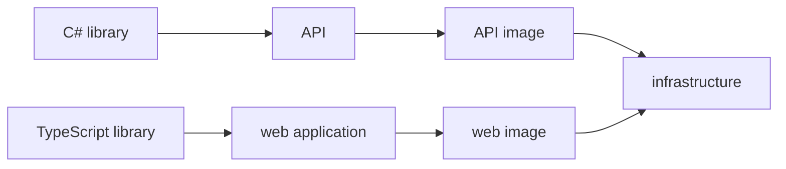

This guide uses the
[Terrabuild Playground](https://github.com/MagnusOpera/terrabuild-playground),
a small monorepo with shared libraries, .NET and web applications, container
images, and a Terraform deployment project.

You need [Terrabuild installed](./install.md), Git, and Docker running.

```bash
git clone https://github.com/MagnusOpera/terrabuild-playground.git
cd terrabuild-playground
```

## What is in the workspace?

The playground has two application paths. Each application depends on a library
and can produce a container image. The infrastructure project depends on both
applications.


```mermaid
flowchart LR
  cslib["C# library"] --> api["API"]
  tslib["TypeScript library"] --> web["web application"]
  api --> apiImage["API image"]
  web --> webImage["web image"]
  apiImage --> infrastructure["infrastructure"]
  webImage --> infrastructure

  class cslib,tslib tb-muted
  class api,web,apiImage,webImage tb-secondary
  class infrastructure tb-primary
```

Terrabuild discovers this model from the repository's `WORKSPACE` and `PROJECT`
files.

## 1. Preview the first outcome

Ask Terrabuild what it would do to produce the distributable applications:

```bash
terrabuild explain dist
```

`explain` resolves the delivery graph without executing commands. You should see
the application `dist` targets and the library and application work they require.

The detailed output includes cache and scheduling information. For now, focus
on two questions:

- Which projects were selected?
- Which prerequisite appears before each application?

## 2. Build the distributable applications

Run the outcome you just inspected:

```bash
terrabuild run dist
```

Terrabuild builds the required libraries and applications, then creates the
application images. Independent branches can run concurrently.

Your underlying tools still perform each operation. Terrabuild is coordinating
their order and collecting the results.

## 3. Run it again

Without changing the repository, run the same command:

```bash
terrabuild run dist
```

The declared inputs still match the previous result, so Terrabuild can reuse
the completed work. Some results restore files from the local cache; externally
owned results, such as container images, can reuse their successful record.

This is desired-state delivery in its simplest form: the requested outcome is
already satisfied, so there is no reason to repeat every command.

## 4. Change one project

Edit a tracked source file in either library, then inspect or run `dist` again:

```bash
terrabuild explain dist
terrabuild run dist
```

The change follows the project dependencies into the affected application.
Work on the other application path can remain satisfied.

Undo the source edit when you are finished with the experiment.

## 5. Follow the path to an environment

The infrastructure project connects both application distributions to a
Terraform plan and deployment. Inspect that path without changing infrastructure:

```bash
terrabuild explain deploy --environment staging
```

The result should include:

1. the application distributions required by infrastructure;
2. the Terraform plan for `staging`;
3. the final deployment target.

The deployment is shown, but `explain` does not execute it.

## The configuration behind the result

The workspace describes the relationships you just observed:

```hcl {filename="WORKSPACE"}
target build {
  depends_on = [ target.^build ]
}

target dist {
  depends_on = [ target.build target.^build ]
}

target plan {
  depends_on = [ target.^dist ]
  environment_sensitive = true
}

target deploy {
  depends_on = [ target.plan ]
  build = ~always
  artifacts = ~none
}
```

Read this from the requested outcome backwards:

- `deploy` requires `plan`;
- `plan` requires distributions from upstream application projects;
- `dist` requires builds from the current and upstream projects;
- `build` follows the project dependency graph.

`deploy` is marked as an action that must run whenever selected. A prior
deployment is historical evidence, not proof that an environment still matches.

Each `PROJECT` file then supplies the commands for its unit. For example, an
application can attach .NET and Docker commands to the shared targets, while
the infrastructure project attaches Terraform commands.

You do not need to understand every target attribute yet. The
[deployment guide](./deployment.md) explains the few policies that matter when
crossing into an environment; [Target policies](./target-policies.md) is the
complete decision guide.

## What you have seen

The playground demonstrates the main Terrabuild model:

- ask for an outcome rather than scripting every step;
- follow changes through project and target dependencies;
- run independent work concurrently;
- reuse results that already satisfy the graph;
- extend the same graph from source into an environment;
- inspect a delivery before executing it.

Continue with [Model a deployment](./deployment.md), or use
[Scaffolding](./scaffolding.md) to create an initial model for your own
repository.
