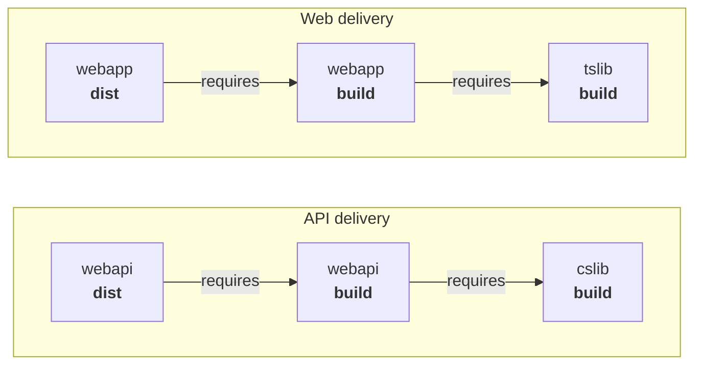

This guide uses the [Terrabuild Playground](https://github.com/MagnusOpera/terrabuild-playground), a small monorepo with .NET and web applications, shared libraries, container images, and a Terraform deployment project.

You need Terrabuild installed and Docker running.

Clone the repository to follow along.

The playground repository defines the following projects and dependencies. Arrows point from a task to the task it requires:


```mermaid
flowchart LR
  subgraph api["API delivery"]
    direction LR
    webapiDist["webapi<br/><b>dist</b>"] -->|requires| webapiBuild["webapi<br/><b>build</b>"] -->|requires| cslibBuild["cslib<br/><b>build</b>"]
  end

  subgraph app["Web delivery"]
    direction LR
    webappDist["webapp<br/><b>dist</b>"] -->|requires| webappBuild["webapp<br/><b>build</b>"] -->|requires| tslibBuild["tslib<br/><b>build</b>"]
  end

  class webapiDist,webappDist tb-primary
  class webapiBuild,webappBuild tb-secondary
  class cslibBuild,tslibBuild tb-muted
```

## Run the first build

To build the entire workspace, run:

```bash
terrabuild run dist
```

This command:

1. Discovers all projects in the workspace
2. Builds the dependency graph
3. Checks the cache for each selected task
4. Builds only what is required
5. Executes tasks in parallel where possible

After the first build, modify a file in one project and run the command again. Terrabuild rebuilds the affected tasks and restores reusable work from cache.

## Read the configuration

Here is the current playground configuration, with the shared policy first and then each application or library project:

```hcl {filename="WORKSPACE"}
# build project dependencies first
target build {
    depends_on = [ target.^build ]
    build = ~auto
    artifacts = ~managed
    batch = ~partition
    environment_sensitive = false
}

# test the current project after building it
target test {
    depends_on = [ target.build ]
}

# build distributable artifacts after the current project and its dependencies
target dist {
    depends_on = [ target.build target.^build ]
}

# deployment targets
target plan {
    depends_on = [ target.^dist ]
    artifacts = ~workspace
    environment_sensitive = true
}

target deploy {
    depends_on = [ target.plan ]
    build = ~always
    artifacts = ~none
}

locals {
    dotnet = {
        config: terrabuild.configuration == "local" ? "Debug" : "Release"
    }
    runtimes = {
        dotnet: terrabuild.arch == "amd64" ? "linux-x64" : "linux-arm64"
        docker: terrabuild.arch == "amd64" ? [ "linux/amd64" ] : [ "linux/arm64" ]
    }
    docker_tags = {
        dotnet_sdk: "9.0"
        dotnet_runtime: "9.0"
        nodejs: "22.16.0-alpine3.22"
        nginx: "1.28.0-alpine"
    }
}

extension @dotnet {
    image = "mcr.microsoft.com/dotnet/sdk:${local.docker_tags.dotnet_sdk}"
    defaults {
        runtime = local.runtimes.dotnet
        configuration = local.dotnet.config
    }
}

extension @docker {
    defaults {
        platforms = local.runtimes.docker
        image = "ghcr.io/magnusopera/${terrabuild.project}"
    }
}

extension @npm {
    image = "node:${local.docker_tags.nodejs}"
}
```

The attributes are policies rather than boilerplate:

- `build` follows upstream projects, reuses matching managed outputs, and batches only dependency-connected compatible components.
- `plan` intentionally varies by deployment environment and keeps its Terraform plan file in the local workspace cache.
- `deploy` is a side effect, so it always executes and retains no reusable result.
- The `dist` commands below finish with Docker builds. Docker owns those images, so their inferred artifact mode is external and Terrabuild reuses only their execution summaries.

The [Target policies](/docs/getting-started/target-policies) guide explains when to choose different values.

```hcl {filename="src/apps/webapi/PROJECT"}
project webapi {
    labels = [ "app" ]
    @dotnet { }
}

target build {
    @dotnet restore { dependencies = true }
    @dotnet build { dependencies = true }
}

target dist {
    @dotnet restore { dependencies = true }
    @dotnet publish { single = true build = true restore = true }
    @docker build {
        build_args = {
            dotnet_version: local.docker_tags.dotnet_runtime
            platform: local.runtimes.dotnet
            configuration: local.dotnet.config
        }
    }
}
```

```hcl {filename="src/apps/webapp/PROJECT"}
project webapp {
    labels = [ "app" ]
    ignores = [ "vite.config.js" "tsconfig.node.tsbuildinfo" "tsconfig.tsbuildinfo" ]
    @npm { }
}

target build {
    @npm build { }
}

target dist {
    @docker build {
        build_args = { nginx_version: local.docker_tags.nginx }
    }
}

target serve {
    @npm dev { }
}
```

```hcl {filename="src/deploy/PROJECT"}
project infrastructure {
    labels = [ "deploy" ]
    depends_on = [ project.webapi project.webapp ]
    environments = [ "staging" "production" ]
    @terraform { }
}

target plan {
    @terraform init { }
    @terraform plan {
        variables = { webapi_version: project.webapi.version
                      webapp_version: project.webapp.version
                      target_environment: terrabuild.environment }
    }
}

target deploy {
    @terraform init { }
    @terraform apply { }
}
```

```hcl {filename="src/libs/cslib/PROJECT"}
project {
    labels = [ "lib" "dotnet" ]
    @dotnet { }
}

target build {
    @dotnet restore { dependencies = true }
    @dotnet build { dependencies = true }
}
```

```hcl {filename="src/libs/tslib/PROJECT"}
project {
    labels = [ "lib" ]
    @npm { }
}

target build {
    @npm build { }
}
```

## Inspect the deployment graph

The playground also connects its application artifacts to Terraform. Inspect that path without executing Terraform:

```bash
terrabuild explain deploy --environment staging
```

The graph includes the application `dist` targets required by `plan`, followed by the Terraform `plan` and `deploy` targets. Inspect the action reason, artifact mode, environment-sensitive inputs, and final scheduling outcome for each node. Continue with [Deployment](./deployment) before adapting this pattern to infrastructure of your own.

## Continue from here

- [Deployment](./deployment): Connect build artifacts to an environment-specific deployment
- [Key concepts](/docs/getting-started/key-concepts): Distinguish projects, targets, tasks, and dependencies
- [Graph](/docs/getting-started/graph): Understand the build graph structure
- [Tasks](/docs/getting-started/tasks): See how tasks execute
- [Target policies](/docs/getting-started/target-policies): Choose scheduling, caching, batching, environment, and lock behavior
- [Caching](/docs/getting-started/caching): See which inputs form a cache key

### Enable remote caching

[Connect the workspace to Insights](./insights) when developer machines and CI should share encrypted artifacts. See [Caching](/docs/getting-started/caching) for cache keys and artifact modes.
