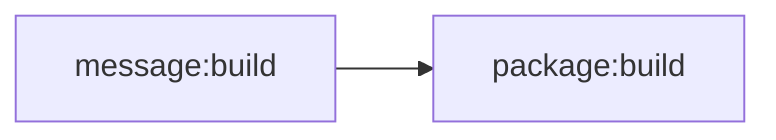

This tutorial makes desired-state configuration concrete: you request a built
package, declare what it needs, and let Terrabuild determine the work.

You will create a tiny workspace with two projects: one prepares
a message, and the other packages it. The tools are deliberately simple so you
can see what Terrabuild contributes: dependencies, execution order, and reusable
results. The same configuration model works with compilers, package managers,
and deployment tools.

You need [Terrabuild](./install.md), Git, and a POSIX shell (`sh`, available on
macOS and Linux). The commands below use Bash-compatible syntax. No container
engine or Insights account is needed.

## 1. Create a workspace

In a new directory, run:

```bash
mkdir terrabuild-tutorial
cd terrabuild-tutorial
git init
mkdir message package
```

Create these files using the names shown above each example.

```terrabuild title="WORKSPACE"
workspace { }

target build {
  depends_on = [ target.^build ]
  artifacts = ~workspace
}
```

`WORKSPACE` holds shared rules. Here, every `build` target waits for `build`
in its dependency projects. `artifacts = ~workspace` tells Terrabuild to keep
outputs in its local cache.

```text title=".gitignore"
**/dist/
```

Generated files belong in `dist/`; they are outputs, not source inputs.

## 2. Define the producer

```text title="message/message.txt"
Hello from Terrabuild!
```

```sh title="message/build.sh"
set -eu
mkdir -p dist
cp message.txt dist/message.txt
```

```terrabuild title="message/PROJECT"
project message {
  outputs = [ "dist/**" ]
}

target build {
  @shell sh { args = "build.sh" }
}
```

A `PROJECT` file describes one unit of work. The `project` block names it and
declares its outputs. The `target` block supplies the command for `build`.

`@shell` is an included extension. Here it invokes `sh build.sh` in the project
directory. Terrabuild supplies the coordination; the shell script produces the file.

## 3. Define the consumer

```sh title="package/build.sh"
set -eu
mkdir -p dist
cat ../message/dist/message.txt > dist/package.txt
printf 'Packaged successfully.\n' >> dist/package.txt
```

```terrabuild title="package/PROJECT"
project package {
  depends_on = [ project.message ]
  outputs = [ "dist/**" ]
}

target build {
  @shell sh { args = "build.sh" }
}
```

The two dependency declarations work together:

- `project.message` says that the package consumes the message project.
- `target.^build` in `WORKSPACE` says which work it needs from that project.


```mermaid
flowchart LR
  message["message:build"] --> package["package:build"]
```

The arrow means “must finish before.” A project relationship alone does not
specify which command should run first; the target relationship supplies that rule.

Your directory should now look like this:

```text
terrabuild-tutorial/
├── .gitignore
├── WORKSPACE
├── message/
│   ├── PROJECT
│   ├── build.sh
│   └── message.txt
└── package/
    ├── PROJECT
    └── build.sh
```

Record the starting files so the tutorial has a Git history:

```bash
git add .
git commit -m "Add tutorial workspace"
```

## 4. Inspect, then run

From the workspace root:

```bash
terrabuild explain build --project package
```

Look for `package:build` and its prerequisite `message:build`. Selecting a
project does not remove the prerequisites it needs. `explain` resolves the
configuration and extension operations without executing those operations.

Now run the same selection:

```bash
terrabuild run build --project package
cat package/dist/package.txt
```

Expected file contents:

```text
Hello from Terrabuild!
Packaged successfully.
```

Terrabuild runs `message:build` before `package:build`. With several independent
projects, it can execute independent branches concurrently.

## 5. Reuse the result

Run the same command again:

```bash
terrabuild run build --project package
```

The inputs have not changed, so Terrabuild can reuse both successful results
and report that everything is up to date.

To see file restoration, add an action that consumes the built package and runs
on every request. Declare the selectable target and its policy in `WORKSPACE`:

```terrabuild title="WORKSPACE"
target inspect {
  depends_on = [ target.build ]
  build = ~always
  artifacts = ~none
}
```

Append its command to `package/PROJECT`:

```terrabuild title="package/PROJECT"
target inspect {
  @shell cat { args = "dist/package.txt" }
}
```

Run it once to establish the result with the updated configuration:

```bash
terrabuild run inspect --project package
```

Then remove only the generated directories and request that consumer again:

```bash
rm -r message/dist package/dist
terrabuild run inspect --project package
cat package/dist/package.txt
```

The file contains the same package contents. Terrabuild restores the prerequisite
files before the consumer reads them. A fully cached `build` request can finish
without executing or restoring tasks; the always-running consumer makes the
need for those files explicit.

Restoration works because you declared both an artifact policy and output paths.
The generic `@shell` extension does not assume arbitrary commands are cacheable;
the workspace policy explicitly makes these repeatable builds cacheable. The
`inspect` target overrides that policy with an action that runs every time.

## 6. Change the producer

```bash
printf 'Hello from a changed input!\n' > message/message.txt
terrabuild explain build --project package
terrabuild run build --project package
cat package/dist/package.txt
```

The message input changes, so its result changes. The package depends on that
result and must run again. Its output now contains the new greeting followed by
`Packaged successfully.`

You have described a dependency once and used it for both ordering and change
propagation. You did not need a separate script that manually runs the projects
in sequence.

## Take it further

- [Adopt Terrabuild in an existing repository](./existing-repository.md): use your native tools and add projects progressively.
- [Configure environments](./environments.md): keep reusable work separate from context-specific work.
- [Customize your tools](./customization.md): replace this shell invocation with a small FScript extension.
- [Explore advanced scenarios](./advanced-scenarios.md): combine generated code, toolchains, deployments, and CI.
