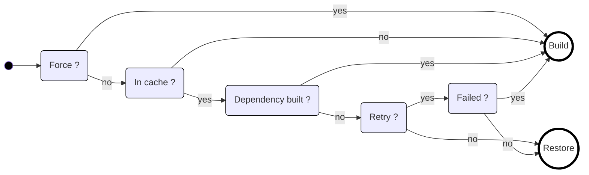

Now that you understand the [build graph](/docs/getting-started/graph) and [caching](/docs/getting-started/caching), let's see how tasks actually execute.

## What is a Task?

A **task** is a concrete execution unit: "build the `build` target for project X". When you run `terrabuild run build`, Terrabuild creates tasks for each project that defines a `build` target. These tasks become nodes in the build graph.

For each task, Terrabuild must decide: **Build** (execute commands) or **Restore** (recover from cache)?

## How Tasks Use Caching

Each task has a cache key computed from:
- Hash of files in the project
- Project dependencies and their versions
- Variables used for the task

:::info
Note that unless you are using specific information from commit (like `terrabuild.head_commit` or `terrabuild.branch_or_tag` variables), this key is unique across branches. This is a really important concept since it enables significant build optimizations - the same build can be reused across different branches if nothing has changed.
:::

Once the key has been computed, Terrabuild uses the target configuration and following decision tree to decide what to do:

| Condition | Description |
|-----------|-------------|
| `Force` | either `--force` or `build` (target) enabled |
| `In cache` | target is available in cache |
| `Dependency built` | a dependency must build |
| `Retry` | `--retry` enabled |
| `Failed` | previous build has failed |

## Task Execution Flow

1. **Decision Made** - Based on the decision tree above, Terrabuild chooses Build or Restore
2. **Execution** - If building, commands run in sequence (or in parallel for independent tasks)
3. **Cache Update** - Results are stored in local cache, and optionally uploaded to Insights for sharing

**Important**: If a task is built (not restored), all dependent tasks in the graph are automatically marked for build. This ensures the graph stays consistent—if a library changes, apps using it are built.

This is how the graph, caching, and task execution work together to give you fast, correct builds.
