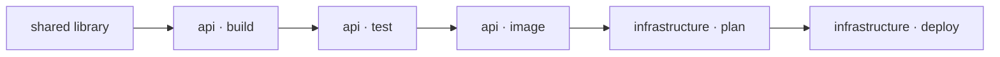

Terrabuild brings desired-state configuration (DSC) to software delivery in
polyglot monorepos. It gives builds, tests, packages, infrastructure plans,
deployments, and cleanup one dependency model.

Terrabuild does not compile code or replace Terraform. Your existing tools still
do that work. Terrabuild selects the required operations, orders them, runs safe
work concurrently, and reuses results whose inputs have not changed.

## DSC, applied to delivery

In desired-state configuration, you declare the result that should hold and let
the engine determine the work required to reach it. Terrabuild applies that
principle to a repository and its delivery paths.

The requested targets and environment state the outcome. Project dependencies,
target dependencies, inputs, artifacts, and policies define what makes that
outcome valid. Terrabuild expands the graph, treats matching reusable results as
already satisfied, and executes the remaining nodes in dependency order.

This is not continuous reconciliation of live infrastructure. Terrabuild does
not inspect a cloud environment and assume it can prove the deployed state.
Targets that change external systems are explicit side effects: when selected,
they run. Terraform, deployment APIs, and other domain tools remain responsible
for reading and changing the systems they own.

## The problem it addresses

A monorepo often has two partial descriptions of delivery:

- project files describe how individual applications and libraries are built;
- CI workflows describe how builds, images, infrastructure, and environments
  are connected.

As the repository grows, those descriptions drift. A local command may not match
CI. A workflow may rebuild every application because it cannot follow project
dependencies. Deployment ordering becomes a sequence of YAML steps that is hard
to inspect before it runs.

Terrabuild puts those relationships in the repository:



The same graph is available to a developer, a pull-request workflow, and a
production release.

## Where it fits well

Terrabuild is most useful when a repository has several of these characteristics:

- multiple applications share libraries, generated clients, or toolchains;
- more than one language or package manager is present;
- applications are packaged as containers or published artifacts;
- preview, staging, and production environments have related but distinct flows;
- a source change should deploy only the applications it affects;
- local development and CI should follow the same dependency rules;
- infrastructure plans and deployments must wait for specific application results;
- the team wants to keep its existing project files and command-line tools.

A small repository with one application and one native build command may not
need another orchestration layer. Terrabuild becomes useful when the delivery
relationships are the difficult part.

## One graph, different kinds of work

Compilation and deployment do not have the same reuse rules. Terrabuild models
that difference explicitly.

| Work | Typical policy | Reason |
| --- | --- | --- |
| Build or test | Reuse when inputs match | The result is deterministic. |
| Generated source | Preserve declared files | Downstream projects consume them. |
| Published image | Reuse its successful summary | The registry owns the artifact. |
| Infrastructure plan | Include the selected environment | A staging plan is not a production plan. |
| Deployment or cleanup | Always execute; retain no reusable result | The operation changes external state. |

This lets a single graph cross the boundary between repeatable computation and
intentional side effects without treating them as the same thing.

## Terrabuild and CI

Terrabuild does not replace the parts of CI that react to repository events,
provide runners, hold credentials, or require approvals. CI invokes Terrabuild
with the target and environment appropriate for the workflow.

The workflow can remain small:

```yaml
- name: Build and test
  run: terrabuild run build test

- name: Deploy staging
  run: terrabuild run deploy --environment staging
```

The repository graph contains the project selection and dependency order. CI
retains responsibility for triggers, permissions, and protected environments.

## Terrabuild and Insights

Terrabuild works locally without an account. Connecting it to
[Insights](../insights/index.md) adds a shared delivery record: encrypted artifact
reuse, execution graphs, environment history, release notes, and engineering
signals enriched with GitHub activity.

Terrabuild converges the declared delivery graph toward the requested state.
Insights records what ran, which states were reached, and what each environment
received.

Continue with the [quick start](./quick-start) to run a complete example, or
read [Deployment](./deployment) to see how application artifacts connect to an
environment-specific Terraform plan.
