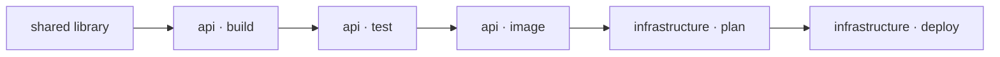

Terrabuild applies **desired-state configuration to build and deployment**.
You request outcomes, declare their prerequisites, and let Terrabuild determine
the necessary work. Builds, tests, generated code, packages, deployments, and
cleanup share this model.

Terrabuild coordinates software delivery across tools, projects, and environments,
using its own configuration language and FScript extension model.

## Desired-state configuration, applied to delivery

In desired-state configuration (DSC), you describe the result that should hold.
The engine determines how to reach it from the available state. In Terrabuild:

| Part of the model | Example |
| --- | --- |
| Desired outcome | Deploy the API to staging. |
| Prerequisites | Build and test the API, produce its image, then prepare its infrastructure plan. |
| Reusable results | A successful build or image publication whose declared inputs still match. |
| Context | Staging settings and the state read by the infrastructure tool. |
| Required actions | Execute missing or changed work, and actions explicitly configured to run every time. |

This explains why Terrabuild is more than a build tool. Its role is to coordinate
whatever tools and environment settings the desired outcome requires. Included
extensions provide common integrations; FScript lets you define your own.

## The problem it addresses

A monorepo often has two partial descriptions of delivery:

- project files describe how individual applications and libraries are built;
- CI workflows describe how builds, images, infrastructure, and environments
  are connected.

As the repository grows, those descriptions drift. A local command may not match
CI. A workflow may rebuild every application because it cannot follow project
dependencies. Deployment ordering becomes a sequence of YAML steps that is hard
to inspect before it runs.

Terrabuild puts those relationships in the repository:



The same graph is available to a developer, a pull-request workflow, and a
production release.

## Where it fits well

Terrabuild is most useful when a repository has several of these characteristics:

- multiple applications share libraries, generated clients, or toolchains;
- more than one language or package manager is present;
- applications are packaged as containers or published artifacts;
- preview, staging, and production environments have related but distinct flows;
- application delivery paths need independent selection and shared prerequisites;
- local development and CI should follow the same dependency rules;
- infrastructure plans and deployments must wait for specific application results;
- the team wants to keep its existing project files and command-line tools.

A small repository with one application and one native build command may not
need another orchestration layer. Terrabuild becomes useful when the delivery
relationships are the difficult part.

## One graph, different kinds of work

Compilation and deployment do not have the same reuse rules. Terrabuild models
that difference explicitly.

| Work | Typical policy | Reason |
| --- | --- | --- |
| Build or test | Reuse when inputs match | The result is deterministic. |
| Generated source | Preserve declared files | Downstream projects consume them. |
| Published image | Reuse its successful summary | The registry owns the artifact. |
| Infrastructure plan | Include the selected environment; refresh when live state matters | A source cache key cannot detect cloud drift. |
| Deployment or cleanup | Always execute; retain no reusable result | The operation changes external state. |

This lets a single graph cross the boundary between repeatable computation and
intentional side effects without treating them as the same thing.

## How this relates to infrastructure state

Terrabuild resolves the requested graph on each invocation. Its reusable results
are evidence about declared work and inputs; they are not a live inventory of a
cloud environment. The underlying tools remain responsible for reading and
changing the systems they own.

For example, an infrastructure plan can observe external changes outside the
repository. Configure it to refresh when that matters, and configure the apply
with `build = ~always` and `artifacts = ~none` when every selection must execute
that action. See [Model a deployment](./deployment.md) for the full example.

## Terrabuild and CI

Terrabuild does not replace the parts of CI that react to repository events,
provide runners, hold credentials, or require approvals. CI invokes Terrabuild
with the target and environment appropriate for the workflow.

The workflow can remain small:

```yaml
- name: Build and test
  run: terrabuild run build test

- name: Deploy staging
  run: terrabuild run deploy --environment staging
```

The repository graph contains the project selection and dependency order. CI
retains responsibility for triggers, permissions, and protected environments.

## Terrabuild and Insights

Terrabuild works locally without an account. Connecting it to
[Insights](../insights/index.md) adds a shared delivery record: encrypted artifact
reuse, execution graphs, environment history, release notes, and engineering
signals enriched with GitHub activity.

Terrabuild converges the declared delivery graph toward the requested state.
Insights records what ran, which states were reached, and what each environment
received.

Continue with the [quick start](./quick-start) to run a complete example, or
read [Deployment](./deployment) to see how application artifacts connect to an
environment-specific infrastructure plan.
