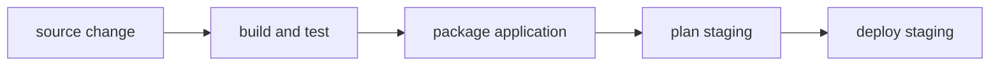

Terrabuild brings desired-state thinking to software delivery.

You declare the outcome you want—built, tested, packaged, planned, or deployed.
Terrabuild follows dependencies from source to environment, reuses results that
already satisfy the graph, and runs the remaining work.

Your existing tools stay in place. .NET still compiles the application, pnpm
still builds the frontend, Docker still creates the image, and Terraform still
changes the infrastructure. Terrabuild connects their work into one delivery
model that runs locally and in CI.

```bash
terrabuild run deploy --environment staging
```

From that request, Terrabuild can determine which applications are involved,
which prerequisites must run, which outputs can be restored, and what must
complete before staging can change.

## The idea in one picture



You request the destination on the right. Terrabuild resolves the prerequisites
to its left. If a prerequisite already has a valid result, Terrabuild reuses it
instead of repeating the command.

This is the central model. Graph construction, cache keys, batching, phases,
and artifact modes refine how it works; you do not need them to understand the
product or complete the quick start.

## Where to begin

If Terrabuild is new to you:

1. Read [How Terrabuild works](getting-started/how-it-works.md).
2. [Install Terrabuild](getting-started/install.md).
3. Follow the [quick start](getting-started/quick-start.md) in the playground.
4. Read [Model a deployment](getting-started/deployment.md) when you are ready to connect applications to an environment.

If you are evaluating whether it fits your repository, start with
[Why Terrabuild?](getting-started/why-terrabuild.md).

## Terrabuild and Insights

Terrabuild converges the requested delivery graph. [Insights](insights/index.md)
keeps the delivery record: what ran, which changes reached each environment,
how releases differ, and how delivery evolves over time. Insights also provides
encrypted artifact sharing between authorized developer machines and CI.

Terrabuild works locally without an Insights account.

## When you need more detail

The **Deep dive** section explains tasks, graph construction, caching, target
policy, batching, phases, and diagnostic commands. The **Reference** sections
document every configuration block, expression, command, and extension.
