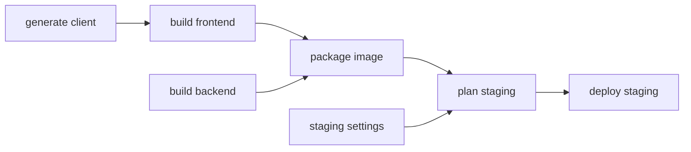

Terrabuild applies **desired-state configuration (DSC) to build and deployment**.
Describe the result you want and the conditions that make it valid. Terrabuild
determines the work needed to reach it.

For software delivery, that result might be an application built and tested, an
image packaged, or a chosen version deployed to staging. You declare the
prerequisites, inputs, and policies that make the result valid. Terrabuild resolves
those declarations into a graph, reuses matching results where permitted, and
executes the remaining work.

**Coordination is how it gets there.** Terrabuild connects your tools, projects,
and environment settings. Compilers, package managers, and infrastructure tools
still perform their own work; Terrabuild brings their outcomes into one model.

For example, a frontend may need a generated API client before it can build. A
container image may need that frontend and a backend. A deployment may need both
the image and settings for staging. Terrabuild coordinates those relationships
on a developer machine and in CI.

## Describe the work, request the outcome

```bash
terrabuild run build test
terrabuild explain deploy --environment staging
```

`build`, `test`, and `deploy` are target names defined by the repository.
`run` executes the required work; `explain` shows the resolved plan without
executing its operations.



You declare the dependencies once. Terrabuild follows them, runs independent work
concurrently, and reuses matching results according to each target's policy.
Operations that change external state, such as deploying, can be configured to
run on every request.

## Batteries included, with room to customize

Included extensions connect tools such as .NET, npm, pnpm, Docker, and Go.
They provide actions and, where supported, discover project metadata from native
project files. Configure their arguments, container images, and environment
values to suit your repository.

For a different tool or a different integration, write an **FScript extension**.
It translates your target actions into commands and can also supply project
defaults and batching behavior. No Terrabuild rebuild is required.

## Make environment differences explicit

A compilation may be reusable in staging and production, while an infrastructure
plan must use the selected environment. Terrabuild lets you model that boundary
with variables, project selection, extension settings, and environment-sensitive
targets. The same graph can then serve several environments without duplicating
the whole workflow.

Terrabuild runs when invoked; it does not continuously reconcile live systems.
Your infrastructure tools own external state, and CI owns triggers, credentials,
and approvals.

## Start small, then expand

Begin with [Start here](getting-started/index.md), or go straight to
[your first coordinated workflow](getting-started/quick-start.md). The tutorial
uses two small shell scripts so you can learn the model before introducing a
full toolchain.

Then [adopt your existing tools](getting-started/existing-repository.md),
[configure environments](getting-started/environments.md), and
[add custom actions](getting-started/customization.md). The
[advanced scenarios](getting-started/advanced-scenarios.md) show how those pieces
combine in larger repositories.

[Insights](insights/index.md) is the optional service for shared encrypted
artifacts, execution graphs, and environment and release history. Local execution
and caching work without an account.
