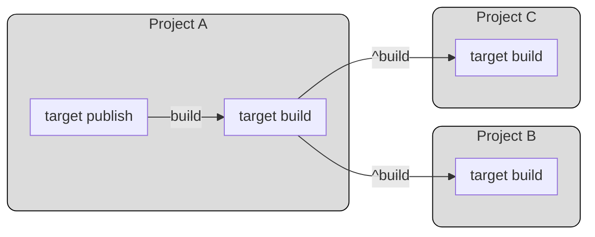

The `target` block defines workspace-wide behavior for a target name.
Use it to declare defaults such as dependency rules, cacheability, and batch mode that apply across projects unless overridden in `PROJECT`.

## Dependency Syntax

The `depends_on` attribute uses target references:

- `target.^<name>`: require the target on upstream dependency projects
- `target.<name>`: require the target on the current project

Typical pattern:

```hcl
target build {
  depends_on = [ target.^build ]
}

target dist {
  depends_on = [ target.build ]
}
```

See [Key Concepts](/docs/getting-started/key-concepts) for the higher-level explanation.

Example diagram:



## Example Usage
```hcl
target build {
    depends_on = [ target.^build
                   target.init ]
    build = ~auto
    artifacts = ~managed
    batch = ~partition
}
```

## Argument Reference

The following arguments are supported:

* `identifier` - (Mandatory) Identifier of the target. This defines the target name that applies globally to all projects.
* `depends_on` - (Optional) List of target references that must complete first. Use `target.^<name>` for upstream project dependencies and `target.<name>` for same-project dependencies.
* `outputs` - (Optional) Override default outputs for this target. By default, the value is the set of `outputs` from the project configuration and extensions used in the target. Specifies which files/directories should be cached as build artifacts.
* `build` - (Optional) Override default build mode. By default, the target is built if the hash has changed (`~auto`). Possible values:
  * `~auto` - Build when changes are detected (default)
  * `~always` - Always build, ignoring cache
  * `~lazy` - Build once only when needed by another node
* `batch` - (Option) Override default batch mode. Extension must support batch mode to enable this feature. Possible values:
  * `~single` - Build all affected nodes using a single batch (default)
  * `~never` - Build affected nodes without batching
  * `~partition` - Create partitions for affected nodes and build each in its own batch
* `artifacts` - (Optional) Override cacheability of the artifacts. By default, the value is the cacheability of the last command. Possible values:
  * `~none` - Do not cache artifacts
  * `~workspace` - Cache artifacts in workspace cache
  * `~managed` - Cache artifacts in managed cache (Insights)
  * `~external` - Cache artifacts externally
