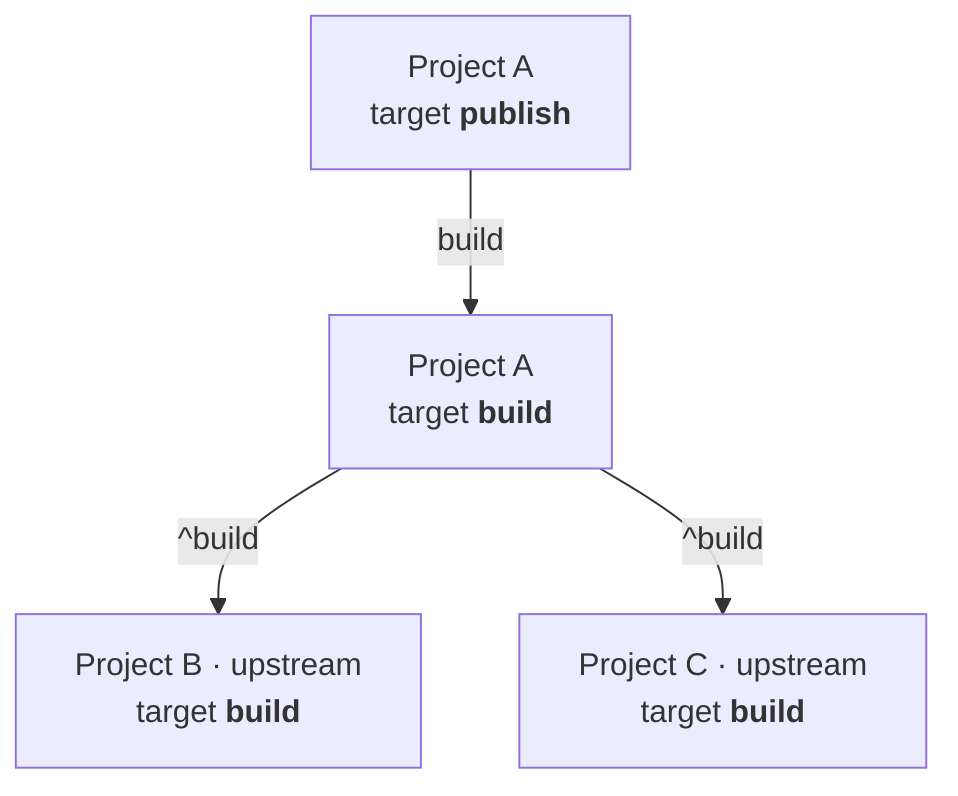

The `target` block defines workspace-wide behavior for a target name.
Use it to declare defaults such as dependency rules, cacheability, batch mode, and an optional [phase](./phase) that apply across projects unless overridden in `PROJECT`.

## Dependency Syntax

The `depends_on` attribute uses target references:

- `target.^<name>`: require the target on upstream dependency projects
- `target.<name>`: require the target on the current project

References only add targets that exist in the relevant project scope. For example, `target.^build` adds `build` only for upstream dependency projects that define a `build` target, and `target.dist` adds the same-project `dist` target only when the current project defines it.

Circular target dependency chains are invalid. Terrabuild detects them during graph construction and reports the cycle path before any commands run.

Typical pattern:

```hcl
target build {
  depends_on = [ target.^build ]
}

target dist {
  depends_on = [ target.build ]
}
```

See [Key Concepts](/docs/getting-started/key-concepts) for the higher-level explanation.

Example diagram:



## Example Usage
```hcl
target build {
    phase = phase.application
    depends_on = [ target.^build
                   target.init ]
    build = ~auto
    artifacts = ~managed
    batch = ~partition
}
```

## Argument Reference

The following arguments are supported:

* `identifier` - (Mandatory) Identifier of the target. This defines the target name that applies globally to all projects.
* `phase` - (Optional) Assign matching project targets to a [workspace phase](./phase), using `phase.<name>`. A project target inherits this value when it does not declare `phase`; it can override it with another phase or opt out using `phase = nothing`.
* `depends_on` - (Optional) List of target references that must complete first. Use `target.^<name>` for upstream project dependencies and `target.<name>` for same-project dependencies.
* `outputs` - (Optional) Override default outputs for this target. By default, the value is the set of `outputs` from the project configuration and extensions used in the target. Specifies which files/directories should be cached as build artifacts.
* `build` - (Optional) Override default build mode. By default, the target is built if the hash has changed (`~auto`). Possible values:
  * `~auto` - Build when changes are detected (default)
  * `~always` - Always build, ignoring cache
  * `~lazy` - Do not run as a selected root; build only when required by another node
* `batch` - (Optional) Override default batch mode. Extension must support batch mode to enable this feature. Batching is applied only to required, compatible nodes in a cluster that contains at least one node that must build. Possible values:
  * `~single` - Build all required compatible nodes in the cluster using a single batch (default)
  * `~never` - Build affected nodes without batching
  * `~partition` - Split compatible nodes into dependency-connected partitions and build each partition in its own batch
* `artifacts` - (Optional) Override cacheability of the artifacts. By default, the value is the cacheability of the last command. Possible values:
  * `~none` - Do not cache artifacts
  * `~workspace` - Cache artifacts in workspace cache
  * `~managed` - Cache artifacts in managed cache (Insights)
  * `~external` - Cache artifacts externally
