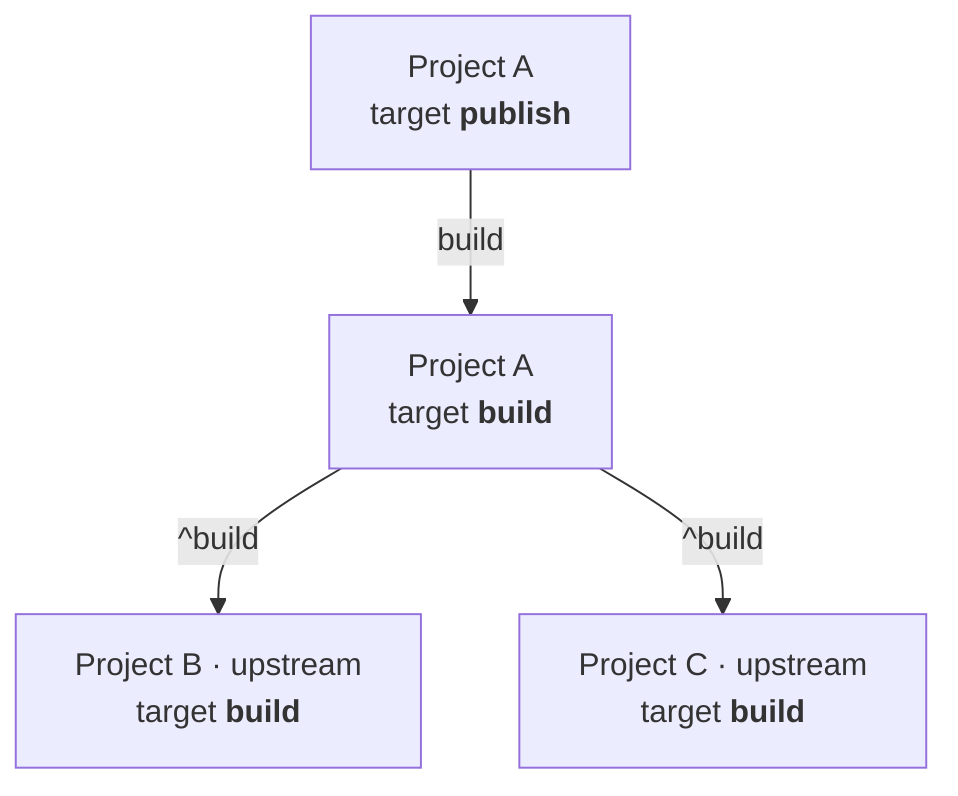

The `target` block defines workspace-wide behavior for a target name.
Use it to declare defaults such as dependency rules, cacheability, batch mode, and an optional [phase](./phase) that apply across projects unless overridden in `PROJECT`.

Use [Target policies](/docs/getting-started/target-policies) to choose values from a use case. This page is the complete workspace-level syntax and inheritance reference.

## Dependency syntax

The `depends_on` attribute uses target references:

- `target.^<name>`: require the target on upstream dependency projects
- `target.<name>`: require the target on the current project

References only add targets that exist in the relevant project scope. For example, `target.^build` adds `build` only for upstream dependency projects that define a `build` target, and `target.dist` adds the same-project `dist` target only when the current project defines it.

Circular target dependency chains are invalid. Terrabuild detects them during graph construction and reports the cycle path before any commands run.

Typical pattern:

```hcl
target build {
  depends_on = [ target.^build ]
}

target dist {
  depends_on = [ target.build ]
}
```

See [Key Concepts](/docs/getting-started/key-concepts) for the higher-level explanation.

Example diagram:


```mermaid
flowchart TB
  targetPublishA["Project A<br/>target <b>publish</b>"]
  targetBuildA["Project A<br/>target <b>build</b>"]
  targetBuildB["Project B · upstream<br/>target <b>build</b>"]
  targetBuildC["Project C · upstream<br/>target <b>build</b>"]

  targetPublishA -->|build| targetBuildA
  targetBuildA -->|^build| targetBuildB
  targetBuildA -->|^build| targetBuildC

  class targetPublishA tb-primary
  class targetBuildA tb-secondary
  class targetBuildB,targetBuildC tb-muted
```

## Example usage
```hcl
target build {
    phase = phase.application
    depends_on = [ target.^build ]
    build = ~auto
    artifacts = ~managed
    batch = ~partition
    environment_sensitive = false
}
```

This example describes a deterministic application build in a larger workspace: it waits at the application phase barrier, follows upstream project builds, shares output files through Insights, and batches dependency-connected components separately. It remains environment-neutral so accidental deployment context cannot fragment or contaminate the build cache. These are scenario choices rather than required defaults.

## Argument reference

The following arguments are supported:

* `identifier` - (Mandatory) Identifier of the target. This defines the target name that applies globally to all projects.
* `phase` - (Optional) Assign matching project targets to a [workspace phase](./phase), using `phase.<name>`. A project target inherits this value when it does not declare `phase`; it can override it with another phase or opt out using `phase = nothing`.
* `depends_on` - (Optional) List of target references that must complete first. Use `target.^<name>` for upstream project dependencies and `target.<name>` for same-project dependencies.
* `outputs` - (Optional) Override default outputs for this target. By default, the value is the set of `outputs` from the project configuration and extensions used in the target. Specifies which files/directories should be cached as build artifacts.
* `build` - (Optional) Override default build mode. By default, the target is built if the hash has changed (`~auto`). Possible values:
  * `~auto` - Build when changes are detected (default)
  * `~always` - Always build, ignoring cache
  * `~lazy` - Build on cache miss when selected explicitly, but realize it as a dependency only when an executing dependent requires it; its execution does not force dependents to rebuild
* `batch` - (Optional) Override default batch mode. Extension must support batch mode to enable this feature. Batching is applied only to required, compatible nodes in a cluster that contains at least one node that must build. Possible values:
  * `~single` - Build all required compatible nodes in the cluster using a single batch (default)
  * `~never` - Build affected nodes without batching
  * `~partition` - Split compatible nodes into dependency-connected partitions and build each partition in its own batch
* `artifacts` - (Optional) Override cacheability of the artifacts. By default, the value is the cacheability of the last command. Possible values:
  * `~none` - Do not cache artifacts
  * `~workspace` - Cache artifacts in workspace cache
  * `~managed` - Cache artifacts in managed cache (Insights)
  * `~external` - The action manages its artifacts externally; Terrabuild caches only the execution summary and never restores artifact files
* `lock` - (Optional) Name a machine-global resource that matching targets must use exclusively. Targets with the same name are serialized across threads and concurrent Terrabuild processes. The lock covers command execution, batch output staging, and restoration of declared workspace or managed outputs. A project target inherits this value, may replace it, or may opt out with `lock = nothing`. Lock ownership is released automatically when the process terminates.
* `environment_sensitive` - (Optional) Default opt-in for matching project targets. Omitted targets are environment-neutral. Set it to `true` only for targets whose operations intentionally depend on environment-sensitive predefined variables. A project target may override this boolean.
